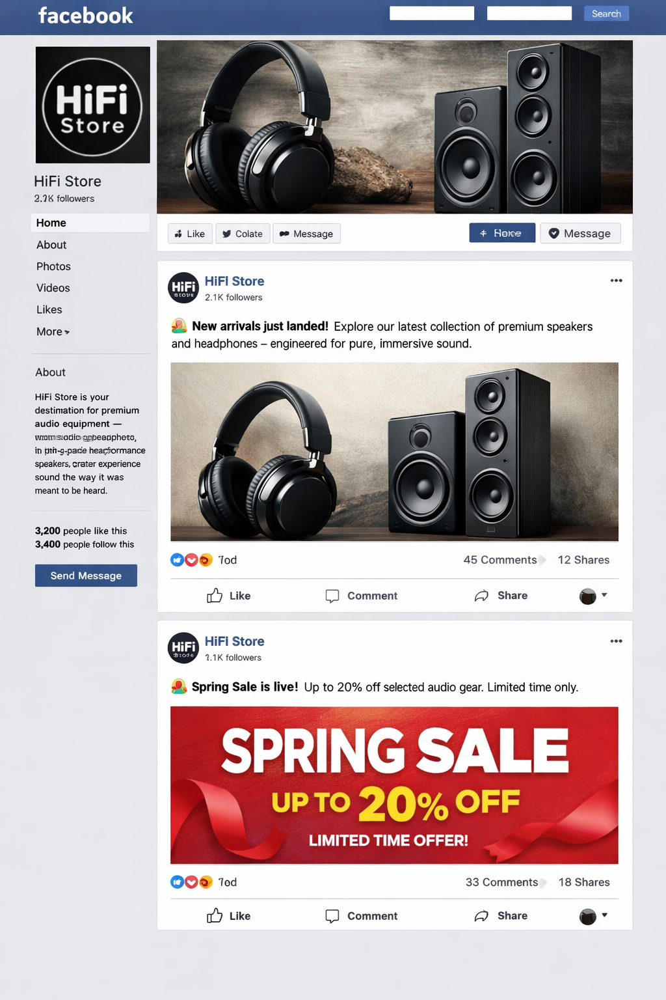

# Portfolio_Project_5

# Hi-Fi Store Web App

## Tech Stack
- Django
- PostgreSQL
- Stripe
- django-allauth
- Whitenoise

## Setup
1. Clone repo
2. Create virtual environment
3. Install dependencies from requirements.txt
4. Run `python manage.py runserver`

## Purpose
A fictional e-commerce site for hi-fi equipment, built as a final project.

## **UX Design & Wireframes**

## **Homepage Wireframe**

 -----------------------------------------------------
|                     NAVBAR                         |
|  HiFi Store | Products | Register/Login or Logout  |
|             | My Orders | Cart (badge)             |
 -----------------------------------------------------
|                    HERO IMAGE                      |
|     Full-width banner (hero.jpeg)                  |
 -----------------------------------------------------
|                CENTERED INTRO TEXT                 |
|   "Experience True Sound"                          |
|   Subtitle: curated selection of audio gear        |
|   [Browse Products] button                         |
 -----------------------------------------------------
|                     FOOTER                         |
|                 © HiFi Store                       |
 -----------------------------------------------------

## **Product Listing Wireframe**

 -----------------------------------------------------
|                     NAVBAR                         |
 -----------------------------------------------------
|                     TITLE                           |
|                   "Products"                        |
 -----------------------------------------------------
|               CATEGORY FILTER BAR                   |
|   All | Amplifiers | Speakers | Turntables ...      |
 -----------------------------------------------------
|                PRODUCT GRID (Bootstrap)             |
|   [Card] [Card] [Card]                              |
|   Image | Name | Price | View Details               |
|   3 per row (col-md-4)                              |
 -----------------------------------------------------
|                     FOOTER                         |
 -----------------------------------------------------

## **Product Detail Wireframe**

 -----------------------------------------------------
|                     NAVBAR                         |
 -----------------------------------------------------
|   [Left: Large Product Image]   [Right: Details]    |
|                                   Name              |
|                                   Brand             |
|                                   Price             |
|                                   [Add to Cart]     |
|                                   Description       |
 -----------------------------------------------------
|                     FOOTER                         |
 -----------------------------------------------------

## **Cart Wireframe**

 -----------------------------------------------------
|                     NAVBAR                         |
 -----------------------------------------------------
|                     TITLE                           |
|                   "Your Cart"                       |
 -----------------------------------------------------
|                     TABLE                           |
|  Product | Qty (− 2 +) | Price | Subtotal | Remove  |
|  Product | Qty         | Price | Subtotal | Remove  |
 -----------------------------------------------------
|                 TOTAL (right aligned)               |
|                 [Proceed to Checkout]               |
 -----------------------------------------------------
|                     FOOTER                         |
 -----------------------------------------------------

## **Checkout Wireframe**
 -----------------------------------------------------
|                     NAVBAR                         |
 -----------------------------------------------------
|                     TITLE                           |
|                    "Checkout"                       |
 -----------------------------------------------------
|   LEFT COLUMN: Customer Details Form                |
|   Full Name                                         |
|   Email                                             |
|   [Pay €XX]                                         |
 -----------------------------------------------------
|   RIGHT COLUMN: Order Summary                       |
|   Product × Qty   €Price                            |
|   Product × Qty   €Price                            |
|   -------------------------                          |
|   Total: €XX                                        |
|   Test card info                                    |
 -----------------------------------------------------
|                     FOOTER                         |
 -----------------------------------------------------

## **My Orders Page Wireframe**
 -----------------------------------------------------
|                     NAVBAR                         |
 -----------------------------------------------------
|                   "My Orders"                       |
 -----------------------------------------------------
|   [Order Box]                                       |
|   Order #ID                                         |
|   Date                                              |
|   Total                                             |
|   Items:                                            |
|     - Product × Qty                                 |
|     - Product × Qty                                 |
 -----------------------------------------------------
|   Repeat for each order                             |
 -----------------------------------------------------
|                     FOOTER                         |
 -----------------------------------------------------

## **User Authentication Wireframe**
 -----------------------------------------------------
|                     NAVBAR                         |
 -----------------------------------------------------
|                     TITLE                           |
|                     "Login"                         |
 -----------------------------------------------------
|   Email                                             |
|   Password                                          |
|   [Login]                                           |
 -----------------------------------------------------
|                     FOOTER                         |
 -----------------------------------------------------

## **Register Wireframe**
 -----------------------------------------------------
|                     NAVBAR                         |
 -----------------------------------------------------
|                     TITLE                           |
|                "Create an Account"                  |
 -----------------------------------------------------
|   Django form fields (as_p)                         |
|   [Register]                                        |
 -----------------------------------------------------
|                     FOOTER                         |
 -----------------------------------------------------

## **Register Wireframe**

-----------------------------------------------------
|              NEWSLETTER SIGNUP                    |
|  "Stay in Tune with HiFi Store"                   |
|  Short description text                           |
|  [ Email input field ] [ Subscribe button ]       |
-----------------------------------------------------

## **404 Error Page Wireframe**
 -----------------------------------------------------
|                     NAVBAR                         |
 -----------------------------------------------------
|                404 — Page Not Found                 |
|   "Looks like this page wandered off..."            |
|   [Return Home]                                     |
 -----------------------------------------------------
|                     FOOTER                         |
 -----------------------------------------------------

## Facebook mock up

## Marketing Strategy

### Target Audience
HiFi Store targets audio enthusiasts, who value high‑quality sound equipment — from headphones and speakers to amplifiers and accessories. The audience includes both casual listeners and semi‑professional users who appreciate premium audio products and a reliable online shopping experience. Secondary audiences include gift buyers and small studio owners seeking affordable, high‑fidelity gear.

### Brand Identity and Messaging
The brand identity emphasizes premium sound, modern design, and trust. Messaging focuses on clarity, performance, and value — appealing to users who want reliable, high‑fidelity audio equipment without unnecessary complexity. Visual branding uses dark tones, clean typography, and product‑forward imagery to evoke professionalism and quality.

### Marketing Channels
HiFi Store’s marketing approach combines organic SEO and social media engagement:

- **Facebook:** Primary channel for product promotion and community engagement. Posts highlight new arrivals, seasonal sales, and featured products.
- **Search Engine Optimization (SEO):** Implemented via canonical `sitemap.xml`, `robots.txt`, descriptive meta tags, and Open Graph data to improve discoverability.
- **Email Marketing (future scope):** Planned for personalized offers and post‑purchase follow‑ups.
- **Word‑of‑Mouth and Reviews:** Encouraged through user testimonials and product ratings.

### Facebook Integration
The site integrates Facebook Pixel to track user interactions and support remarketing campaigns. This enables targeted advertising and audience insights, helping the brand reach users who previously visited the site or interacted with posts.

### Content Strategy
HiFi Store’s content focuses on educating and inspiring users:

- Product spotlights and comparisons
- Audio setup tips and guides
- Seasonal promotions and limited‑time offers
- Brand and design philosophy highlights

This mix of informative and promotional content builds trust and maintains engagement.

### Marketing Goals
1. Increase brand visibility through consistent Facebook posting and SEO optimization.
2. Drive traffic from social media to the e‑commerce site.
3. Convert visitors into customers through clear product presentation and a streamlined checkout flow.
4. Build long‑term loyalty through quality content and responsive support.

### Example Campaigns
- **Spring Sale Campaign:** “Up to 20% off selected audio gear — limited time only.”
- **Product Spotlight:** “Discover the X200 Studio Headphones — engineered for pure, immersive sound.”
- **Community Engagement:** “Share your setup — tag @HiFiStore for a chance to be featured!”

### Performance Tracking
Key success metrics include:

- Facebook engagement (likes, shares, comments)
- Website traffic from social media referrals
- Conversion rate from Facebook Pixel analytics
- SEO ranking improvements for relevant product keywords
