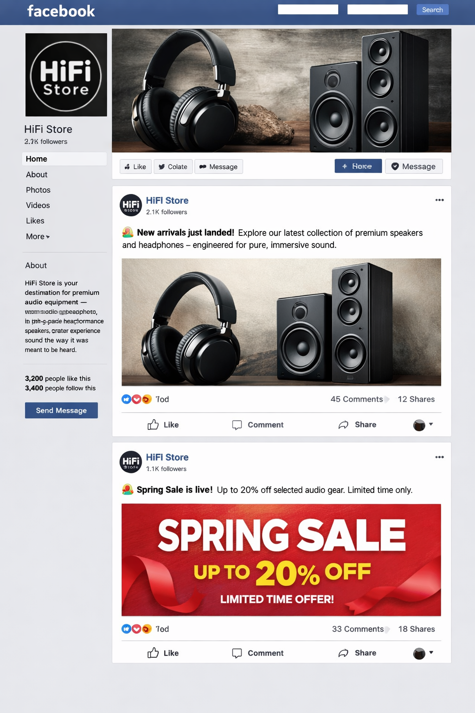

# [Portfolio_Project_5](https://hifi-store-project-5-61926ce0a9e2.herokuapp.com)

Developer: Andreas Pergantis ([andreaspe76](https://www.github.com/andreaspe76))

# Hi-Fi Store Web App

## Tech Stack
- Django
- PostgreSQL
- Stripe
- django-allauth
- Whitenoise

## Purpose
The HiFi Store project is a fully‑functional e‑commerce platform designed for enthusiasts of vintage audio equipment. The goal of the project is to create a clean, intuitive, and reliable online shopping experience where users can browse classic amplifiers, turntables, and speakers, learn more about each product, and complete a secure checkout using Stripe. The platform aims to combine modern web technologies with the charm and personality of retro audio culture, offering a space where users can explore high‑quality gear with confidence.

The project is intended for a niche but passionate audience: people who appreciate the craftsmanship, sound quality, and aesthetic of vintage HiFi equipment. This includes collectors, hobbyists, and newcomers who want to build their first analog setup. By providing clear product information, a simple navigation structure, and a frictionless checkout flow, the site helps users make informed decisions and enjoy a smooth purchasing experience. The inclusion of a Facebook Page and marketing strategy also demonstrates how the brand could build a community and reach its audience beyond the website itself.

I chose this theme because I have a personal interest in audio equipment and the culture around it. Vintage HiFi has a unique identity — it blends engineering, design, nostalgia, and passion — and that made it an inspiring foundation for a project that needed both technical depth and creative direction. Working with this subject allowed me to stay motivated throughout development, because I was building something I could genuinely imagine existing in the real world. It also provided a clear structure for implementing essential e‑commerce features such as product listings, categories, cart management, user accounts, and secure payments, all while giving the project a distinctive personality.

This combination of technical challenge and personal relevance made the HiFi Store the ideal concept for demonstrating my skills, creativity, and understanding of full‑stack development.

## **UX Design & Wireframes**

#### 1. Strategy

**Purpose**
- Provide a seamless and intuitive e-commerce experience for customers to browse, filter, and purchase products.

**Primary User Needs**
- Guest users need to browse products and checkout with ease.
- Registered customers need a streamlined shopping experience with account and order history features.

**Business Goals**
- Drive sales by providing a user-friendly shopping experience.
- Build customer loyalty through personalized and efficient account features.

#### 2. Scope

**[Features](#features)** (see below)

**Content Requirements**
- Product details, including name, price, description, category, and images.
- Clear prompts and instructions for browsing, filtering, and purchasing.
- Order details, confirmation pages.
- Secure payment processing using Stripe.
- 404 page for lost users.

#### 3. Structure

**Information Architecture**
- **Navigation Menu**:
  - Links to Home, Products, Cart, Newsletter, and Account sections.
- **Hierarchy**:
  - Prominent product categories and filters for easy navigation.
  - Cart and checkout options displayed prominently for convenience.

**User Flow**
1. Guest user browses the store → filters and sorts products by category, price, or name.
2. Guest user adds items to the cart → proceeds to checkout.
3. Guest user creates an account or logs in during checkout → completes purchase.
4. Returning customers log in → view past orders and track purchase history.
5. Users signup to the newsletter → potentially receive advanced notice of upcoming sales.

## **Homepage Wireframe**

 -----------------------------------------------------
|                     NAVBAR                         |
|  HiFi Store | Products | Register/Login or Logout  |
|             | My Orders | Cart (badge)             |
 -----------------------------------------------------
|                    HERO IMAGE                      |
|     Full-width banner (hero.jpeg)                  |
 -----------------------------------------------------
|                CENTERED INTRO TEXT                 |
|   "Experience True Sound"                          |
|   Subtitle: curated selection of audio gear        |
|   [Browse Products] button                         |
 -----------------------------------------------------
|                     FOOTER                         |
|                 © HiFi Store                       |
 -----------------------------------------------------

## **Product Listing Wireframe**

 -----------------------------------------------------
|                     NAVBAR                         |
 -----------------------------------------------------
|                     TITLE                           |
|                   "Products"                        |
 -----------------------------------------------------
|               CATEGORY FILTER BAR                   |
|   All | Amplifiers | Speakers | Turntables ...      |
 -----------------------------------------------------
|                PRODUCT GRID (Bootstrap)             |
|   [Card] [Card] [Card]                              |
|   Image | Name | Price | View Details               |
|   3 per row (col-md-4)                              |
 -----------------------------------------------------
|                     FOOTER                         |
 -----------------------------------------------------

## **Product Detail Wireframe**

 -----------------------------------------------------
|                     NAVBAR                         |
 -----------------------------------------------------
|   [Left: Large Product Image]   [Right: Details]    |
|                                   Name              |
|                                   Brand             |
|                                   Price             |
|                                   [Add to Cart]     |
|                                   Description       |
 -----------------------------------------------------
|                     FOOTER                         |
 -----------------------------------------------------

## **Cart Wireframe**

 -----------------------------------------------------
|                     NAVBAR                         |
 -----------------------------------------------------
|                     TITLE                           |
|                   "Your Cart"                       |
 -----------------------------------------------------
|                     TABLE                           |
|  Product | Qty (− 2 +) | Price | Subtotal | Remove  |
|  Product | Qty         | Price | Subtotal | Remove  |
 -----------------------------------------------------
|                 TOTAL (right aligned)               |
|                 [Proceed to Checkout]               |
 -----------------------------------------------------
|                     FOOTER                         |
 -----------------------------------------------------

## **Checkout Wireframe**
 -----------------------------------------------------
|                     NAVBAR                         |
 -----------------------------------------------------
|                     TITLE                           |
|                    "Checkout"                       |
 -----------------------------------------------------
|   LEFT COLUMN: Customer Details Form                |
|   Full Name                                         |
|   Email                                             |
|   [Pay €XX]                                         |
 -----------------------------------------------------
|   RIGHT COLUMN: Order Summary                       |
|   Product × Qty   €Price                            |
|   Product × Qty   €Price                            |
|   -------------------------                          |
|   Total: €XX                                        |
|   Test card info                                    |
 -----------------------------------------------------
|                     FOOTER                         |
 -----------------------------------------------------

## **My Orders Page Wireframe**
 -----------------------------------------------------
|                     NAVBAR                         |
 -----------------------------------------------------
|                   "My Orders"                       |
 -----------------------------------------------------
|   [Order Box]                                       |
|   Order #ID                                         |
|   Date                                              |
|   Total                                             |
|   Items:                                            |
|     - Product × Qty                                 |
|     - Product × Qty                                 |
 -----------------------------------------------------
|   Repeat for each order                             |
 -----------------------------------------------------
|                     FOOTER                         |
 -----------------------------------------------------

## **User Authentication Wireframe**
 -----------------------------------------------------
|                     NAVBAR                         |
 -----------------------------------------------------
|                     TITLE                           |
|                     "Login"                         |
 -----------------------------------------------------
|   Email                                             |
|   Password                                          |
|   [Login]                                           |
 -----------------------------------------------------
|                     FOOTER                         |
 -----------------------------------------------------

## **Register Wireframe**
 -----------------------------------------------------
|                     NAVBAR                         |
 -----------------------------------------------------
|                     TITLE                           |
|                "Create an Account"                  |
 -----------------------------------------------------
|   Django form fields (as_p)                         |
|   [Register]                                        |
 -----------------------------------------------------
|                     FOOTER                         |
 -----------------------------------------------------

## **Register Wireframe**

-----------------------------------------------------
|              NEWSLETTER SIGNUP                    |
|  "Stay in Tune with HiFi Store"                   |
|  Short description text                           |
|  [ Email input field ] [ Subscribe button ]       |
-----------------------------------------------------

## **404 Error Page Wireframe**
 -----------------------------------------------------
|                     NAVBAR                         |
 -----------------------------------------------------
|                404 — Page Not Found                 |
|   "Looks like this page wandered off..."            |
|   [Return Home]                                     |
 -----------------------------------------------------
|                     FOOTER                         |
 -----------------------------------------------------

## User Stories

| Target | Expectation | Outcome |
| --- | --- | --- |
| As a guest user | I would like to browse products without needing to register | so that I can shop freely before deciding to create an account. |
| As a user | I would like to sign up to the site's newsletter | so that I can stay up to date with any upcoming sales or promotions. |
| As a customer | I would like to browse various product categories | so that I can easily find what I'm looking for. |
| As a customer | I would like to filter products by category | so that I can narrow down the products to the types I am most interested in. |
| As a customer | I would like to click on individual products to view more details (description, price, image, etc.) | so that I can make an informed decision about my purchase. |
| As a customer | I would like to add items to my shopping cart using quantity increment/decrement buttons | so that I can adjust how many units of a product I want before checkout. |
| As a customer | I would like to view and manage my shopping cart | so that I can review, add, or remove items before proceeding to checkout. |
| As a customer | I would like to adjust the quantity of items in my cart | so that I can modify my purchase preferences without leaving the cart. |
| As a customer | I would like to remove items from my cart | so that I can remove products I no longer wish to buy. |
| As a customer | I would like to proceed to checkout where I see my cart items, grand total, and input my name, email, shipping address, and card details | so that I can complete my purchase. |
| As a customer | I would like to see an order confirmation page | so that I know my order has been successfully placed. |
| As a customer | I would like to securely enter my card details using Stripe at checkout | so that I can feel confident my payment information is protected. |
| As a returning customer | I would like to be able to log in and view my past orders | so that I can track my previous purchases and order history. |
| As a site owner | I would like to create new products with a name, description, price, images, and category | so that I can add additional items to the store inventory. |
| As a site owner | I would like to update product details (name, price, description, image, category) at any time | so that I can keep my product listings accurate and up to date. |
| As a site owner | I would like to delete products that are no longer available or relevant | so that I can maintain a clean and accurate inventory. |
| As a site owner | I would like to view all orders placed on the website | so that I can track and manage customer purchases. |
| As a site owner | I would like to manage product categories | so that I can ensure items are correctly organized and easy for customers to find. |
| As a user | I would like to see a 404 error page if I get lost | so that it's obvious that I've stumbled upon a page that doesn't exist. |

### Existing Features

| Feature | Notes | Screenshot |
| --- | --- | --- |
| Register | Authentication is handled by allauth, allowing users to register accounts. |  |
| Login | Authentication is handled by allauth, allowing users to log in to their existing accounts. |  |
| Logout | Authentication is handled by allauth, allowing users to log out of their accounts. |  |
| Product List | Users can browse all available products with sorting, filtering by categories, and search functionality. |  |
| Product Details | Displays detailed information about a selected product, including its name, description, price, an image, and available sizes. |  |
| Add to Bag | Users can add items to their shopping bag, with support for selecting different sizes if applicable. |  |
| View Bag | Users can view the contents of their shopping bag, adjust quantities, or remove items. |  |
| Checkout | Users can proceed to checkout, where they provide their delivery details and payment information using Stripe integration. |  |
| Order Confirmation | Users receive an on-screen and email confirmation with details of their purchase. |  |
| Profile Management | Users can manage their profile information, including their default delivery address and order history. |  |
| Order History | Users can view their past orders and access details of each order, including products purchased and the delivery status. |  |
| Product Management | Superusers can add, edit, and delete products from the site via a CRUD interface. |  |
| Newsletter | Users can register their email address to receive newsletters from the site. Currently, this only stores the email in the database. |  |
| Contact | Users can submit a message via the contact form, which stores their name, email, and message in the database. |  |
| FAQs | Admins can manage frequently asked questions, which are displayed on the site for users. |  |
| User Feedback | Clear and concise Django messages are used to provide feedback to users when interacting with various features (e.g., adding products to the bag, checking out, etc.). |  |
| Heroku Deployment | The site is deployed to Heroku, making it accessible online for users. |  |
| SEO | SEO optimization with a sitemap.xml, robots.txt, and appropriate meta tags to improve search engine visibility. |  |
| Marketing | Social media presence is available in the footer using external links, as well as a Facebook Marketplace wireframe in the README for future integrations. |  |
| 404 | The 404 error page will indicate when a user has navigated to a page that doesn't exist, replacing the default Heroku 404 page with one that ties into the site's look and feel. |  |

## Facebook mock up

## Marketing Strategy

### Target Audience
HiFi Store targets audio enthusiasts, who value high‑quality sound equipment — from headphones and speakers to amplifiers and accessories. The audience includes both casual listeners and semi‑professional users who appreciate premium audio products and a reliable online shopping experience. Secondary audiences include gift buyers and small studio owners seeking affordable, high‑fidelity gear.

### Brand Identity and Messaging
The brand identity emphasizes premium sound, modern design, and trust. Messaging focuses on clarity, performance, and value — appealing to users who want reliable, high‑fidelity audio equipment without unnecessary complexity. Visual branding uses dark tones, clean typography, and product‑forward imagery to evoke professionalism and quality.

### Marketing Channels
HiFi Store’s marketing approach combines organic SEO and social media engagement:

- **Facebook:** Primary channel for product promotion and community engagement. Posts highlight new arrivals, seasonal sales, and featured products.
- **Search Engine Optimization (SEO):** Implemented via canonical `sitemap.xml`, `robots.txt`, descriptive meta tags, and Open Graph data to improve discoverability.
- **Email Marketing (future scope):** Planned for personalized offers and post‑purchase follow‑ups.
- **Word‑of‑Mouth and Reviews:** Encouraged through user testimonials and product ratings.

### Facebook Integration
The site integrates Facebook Pixel to track user interactions and support remarketing campaigns. This enables targeted advertising and audience insights, helping the brand reach users who previously visited the site or interacted with posts.

### Content Strategy
HiFi Store’s content focuses on educating and inspiring users:

- Product spotlights and comparisons
- Audio setup tips and guides
- Seasonal promotions and limited‑time offers
- Brand and design philosophy highlights

This mix of informative and promotional content builds trust and maintains engagement.

### Marketing Goals
1. Increase brand visibility through consistent Facebook posting and SEO optimization.
2. Drive traffic from social media to the e‑commerce site.
3. Convert visitors into customers through clear product presentation and a streamlined checkout flow.
4. Build long‑term loyalty through quality content and responsive support.

### Example Campaigns
- **Spring Sale Campaign:** “Up to 20% off selected audio gear — limited time only.”
- **Product Spotlight:** “Discover the X200 Studio Headphones — engineered for pure, immersive sound.”
- **Community Engagement:** “Share your setup — tag @HiFiStore for a chance to be featured!”

### Performance Tracking
Key success metrics include:

- Facebook engagement (likes, shares, comments)
- Website traffic from social media referrals
- Conversion rate from Facebook Pixel analytics
- SEO ranking improvements for relevant product keywords
