# [Portfolio_Project_5](https://hifi-store-project-5-61926ce0a9e2.herokuapp.com)

Developer: Andreas Pergantis ([andreaspe76](https://www.github.com/andreaspe76))

[](https://www.github.com/andreaspe76/Portfolio_Project_5/commits/main)
[](https://www.github.com/andreaspe76/Portfolio_Project_5/commits/main)
[](https://www.github.com/andreaspe76/Portfolio_Project_5)
[](https://hifi-store-project-5-61926ce0a9e2.herokuapp.com)

# Hi-Fi Store Web App

## Tech Stack
- Django
- PostgreSQL
- Stripe
- django-allauth
- Whitenoise

## Purpose
The HiFi Store project is a fully‑functional e‑commerce platform designed for enthusiasts of vintage audio equipment. The goal of the project is to create a clean, intuitive, and reliable online shopping experience where users can browse classic amplifiers, turntables, and speakers, learn more about each product, and complete a secure checkout using Stripe. The platform aims to combine modern web technologies with the charm and personality of retro audio culture, offering a space where users can explore high‑quality gear with confidence.

The project is intended for a niche but passionate audience: people who appreciate the craftsmanship, sound quality, and aesthetic of vintage HiFi equipment. This includes collectors, hobbyists, and newcomers who want to build their first analog setup. By providing clear product information, a simple navigation structure, and a frictionless checkout flow, the site helps users make informed decisions and enjoy a smooth purchasing experience. The inclusion of a Facebook Page and marketing strategy also demonstrates how the brand could build a community and reach its audience beyond the website itself.

I chose this theme because I have a personal interest in audio equipment and the culture around it. Vintage HiFi has a unique identity — it blends engineering, design, nostalgia, and passion — and that made it an inspiring foundation for a project that needed both technical depth and creative direction. Working with this subject allowed me to stay motivated throughout development, because I was building something I could genuinely imagine existing in the real world. It also provided a clear structure for implementing essential e‑commerce features such as product listings, categories, cart management, user accounts, and secure payments, all while giving the project a distinctive personality.

This combination of technical challenge and personal relevance made the HiFi Store the ideal concept for demonstrating my skills, creativity, and understanding of full‑stack development.


## **UX Design & Wireframes**

#### 1. Strategy

**Purpose**
- Provide a seamless and intuitive e-commerce experience for customers to browse, filter, and purchase products.

**Primary User Needs**
- Guest users need to browse products and checkout with ease.
- Registered customers need a streamlined shopping experience with account and order history features.

**Business Goals**
- Drive sales by providing a user-friendly shopping experience.
- Build customer loyalty through personalized and efficient account features.

#### 2. Scope

**[Features](#features)** (see below)

**Content Requirements**
- Product details, including name, price, description, category, and images.
- Clear prompts and instructions for browsing, filtering, and purchasing.
- Order details, confirmation pages.
- Secure payment processing using Stripe.
- 404 page for lost users.

#### 3. Structure

**Information Architecture**
- **Navigation Menu**:
  - Links to Home, Products, Cart, Newsletter, and Account sections.
- **Hierarchy**:
  - Prominent product categories and filters for easy navigation.
  - Cart and checkout options displayed prominently for convenience.

**User Flow**
1. Guest user browses the store → filters and sorts products by category, price, or name.
2. Guest user adds items to the cart → proceeds to checkout.
3. Guest user creates an account or logs in during checkout → completes purchase.
4. Returning customers log in → view past orders and track purchase history.
5. Users signup to the newsletter → potentially receive advanced notice of upcoming sales.


## **Homepage Wireframe**

 -----------------------------------------------------
|                     NAVBAR                         |
|  HiFi Store | Products | Register/Login or Logout  |
|             | My Orders | Cart (badge)             |
 -----------------------------------------------------
|                    HERO IMAGE                      |
|     Full-width banner (hero.jpeg)                  |
 -----------------------------------------------------
|                CENTERED INTRO TEXT                 |
|   "Experience True Sound"                          |
|   Subtitle: curated selection of audio gear        |
|   [Browse Products] button                         |
 -----------------------------------------------------
|                     FOOTER                         |
|                 © HiFi Store                       |
 -----------------------------------------------------


## **Product Listing Wireframe**

 -----------------------------------------------------
|                     NAVBAR                         |
 -----------------------------------------------------
|                     TITLE                           |
|                   "Products"                        |
 -----------------------------------------------------
|               CATEGORY FILTER BAR                   |
|   All | Amplifiers | Speakers | Turntables ...      |
 -----------------------------------------------------
|                PRODUCT GRID (Bootstrap)             |
|   [Card] [Card] [Card]                              |
|   Image | Name | Price | View Details               |
|   3 per row (col-md-4)                              |
 -----------------------------------------------------
|                     FOOTER                         |
 -----------------------------------------------------


## **Product Detail Wireframe**

 -----------------------------------------------------
|                     NAVBAR                         |
 -----------------------------------------------------
|   [Left: Large Product Image]   [Right: Details]    |
|                                   Name              |
|                                   Brand             |
|                                   Price             |
|                                   [Add to Cart]     |
|                                   Description       |
 -----------------------------------------------------
|                     FOOTER                         |
 -----------------------------------------------------


## **Cart Wireframe**

 -----------------------------------------------------
|                     NAVBAR                         |
 -----------------------------------------------------
|                     TITLE                           |
|                   "Your Cart"                       |
 -----------------------------------------------------
|                     TABLE                           |
|  Product | Qty (− 2 +) | Price | Subtotal | Remove  |
|  Product | Qty         | Price | Subtotal | Remove  |
 -----------------------------------------------------
|                 TOTAL (right aligned)               |
|                 [Proceed to Checkout]               |
 -----------------------------------------------------
|                     FOOTER                         |
 -----------------------------------------------------


## **Checkout Wireframe**
 -----------------------------------------------------
|                     NAVBAR                         |
 -----------------------------------------------------
|                     TITLE                           |
|                    "Checkout"                       |
 -----------------------------------------------------
|   LEFT COLUMN: Customer Details Form                |
|   Full Name                                         |
|   Email                                             |
|   [Pay €XX]                                         |
 -----------------------------------------------------
|   RIGHT COLUMN: Order Summary                       |
|   Product × Qty   €Price                            |
|   Product × Qty   €Price                            |
|   -------------------------                          |
|   Total: €XX                                        |
|   Test card info                                    |
 -----------------------------------------------------
|                     FOOTER                         |
 -----------------------------------------------------


## **My Orders Page Wireframe**
 -----------------------------------------------------
|                     NAVBAR                         |
 -----------------------------------------------------
|                   "My Orders"                       |
 -----------------------------------------------------
|   [Order Box]                                       |
|   Order #ID                                         |
|   Date                                              |
|   Total                                             |
|   Items:                                            |
|     - Product × Qty                                 |
|     - Product × Qty                                 |
 -----------------------------------------------------
|   Repeat for each order                             |
 -----------------------------------------------------
|                     FOOTER                         |
 -----------------------------------------------------


## **User Authentication Wireframe**
 -----------------------------------------------------
|                     NAVBAR                         |
 -----------------------------------------------------
|                     TITLE                           |
|                     "Login"                         |
 -----------------------------------------------------
|   Email                                             |
|   Password                                          |
|   [Login]                                           |
 -----------------------------------------------------
|                     FOOTER                         |
 -----------------------------------------------------


## **Register Wireframe**
 -----------------------------------------------------
|                     NAVBAR                         |
 -----------------------------------------------------
|                     TITLE                           |
|                "Create an Account"                  |
 -----------------------------------------------------
|   Django form fields (as_p)                         |
|   [Register]                                        |
 -----------------------------------------------------
|                     FOOTER                         |
 -----------------------------------------------------


## **Register Wireframe**

-----------------------------------------------------
|              NEWSLETTER SIGNUP                    |
|  "Stay in Tune with HiFi Store"                   |
|  Short description text                           |
|  [ Email input field ] [ Subscribe button ]       |
-----------------------------------------------------


## **404 Error Page Wireframe**
 -----------------------------------------------------
|                     NAVBAR                         |
 -----------------------------------------------------
|                404 — Page Not Found                 |
|   "Looks like this page wandered off..."            |
|   [Return Home]                                     |
 -----------------------------------------------------
|                     FOOTER                         |
 -----------------------------------------------------

## User Stories

| Target | Expectation | Outcome |
| --- | --- | --- |
| As a guest user | I would like to browse products without needing to register | so that I can shop freely before deciding to create an account. |
| As a user | I would like to sign up to the site's newsletter | so that I can stay up to date with any upcoming sales or promotions. |
| As a customer | I would like to browse various product categories | so that I can easily find what I'm looking for. |
| As a customer | I would like to filter products by category | so that I can narrow down the products to the types I am most interested in. |
| As a customer | I would like to click on individual products to view more details (description, price, image, etc.) | so that I can make an informed decision about my purchase. |
| As a customer | I would like to add items to my shopping cart using quantity increment/decrement buttons | so that I can adjust how many units of a product I want before checkout. |
| As a customer | I would like to view and manage my shopping cart | so that I can review, add, or remove items before proceeding to checkout. |
| As a customer | I would like to adjust the quantity of items in my cart | so that I can modify my purchase preferences without leaving the cart. |
| As a customer | I would like to remove items from my cart | so that I can remove products I no longer wish to buy. |
| As a customer | I would like to proceed to checkout where I see my cart items, grand total, and input my name, email, shipping address, and card details | so that I can complete my purchase. |
| As a customer | I would like to see an order confirmation page | so that I know my order has been successfully placed. |
| As a customer | I would like to securely enter my card details using Stripe at checkout | so that I can feel confident my payment information is protected. |
| As a returning customer | I would like to be able to log in and view my past orders | so that I can track my previous purchases and order history. |
| As a site owner | I would like to create new products with a name, description, price, images, and category | so that I can add additional items to the store inventory. |
| As a site owner | I would like to update product details (name, price, description, image, category) at any time | so that I can keep my product listings accurate and up to date. |
| As a site owner | I would like to delete products that are no longer available or relevant | so that I can maintain a clean and accurate inventory. |
| As a site owner | I would like to view all orders placed on the website | so that I can track and manage customer purchases. |
| As a site owner | I would like to manage product categories | so that I can ensure items are correctly organized and easy for customers to find. |
| As a user | I would like to see a 404 error page if I get lost | so that it's obvious that I've stumbled upon a page that doesn't exist. |


### Existing Features

| Feature | Notes | Screenshot |
| --- | --- | --- |
| Register | Authentication is handled by allauth, allowing users to register accounts. | 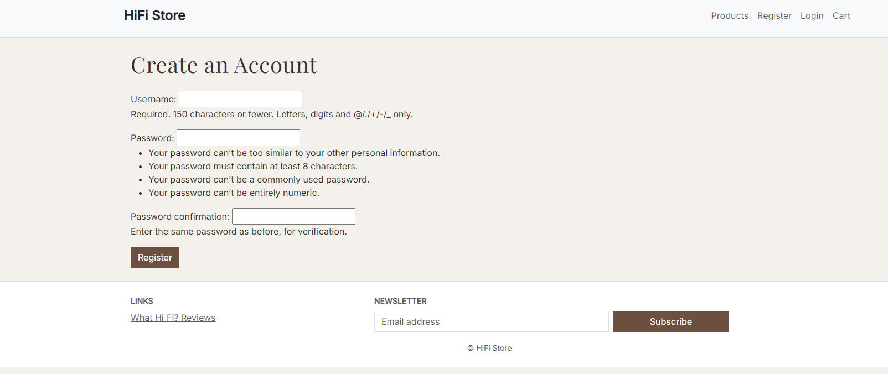 |
| Login | Authentication is handled by allauth, allowing users to log in to their existing accounts. | 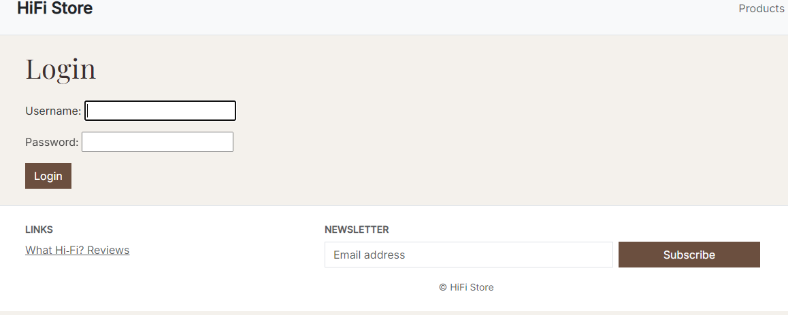 |
| Logout | Authentication is handled by allauth, allowing users to log out of their accounts. | 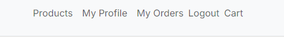 |
| Product List | Users can browse all available products with sorting, filtering by categories, and search functionality. | 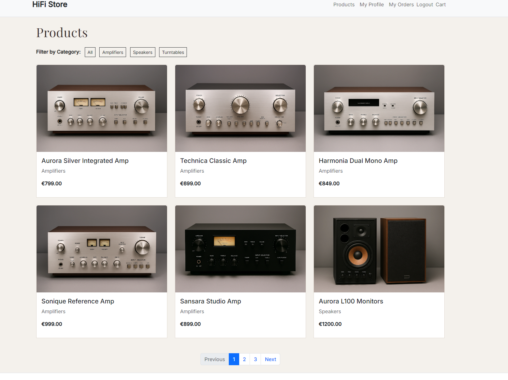 |
| Product Details | Displays detailed information about a selected product, including its name, description, price, an image, and available sizes. | 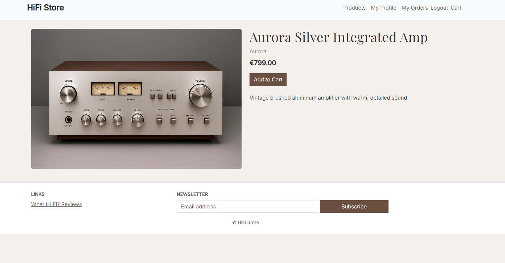 |
| Add to Cart | Users can add items to their shopping cart, with support for selecting different sizes if applicable. | 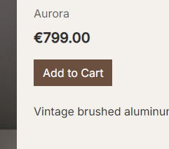 |
| View Cart | Users can view the contents of their shopping cart, adjust quantities, or remove items. | 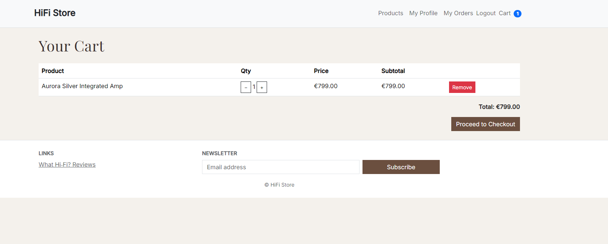 |
| Checkout | Users can proceed to checkout, where they provide their delivery details and payment information using Stripe integration. | 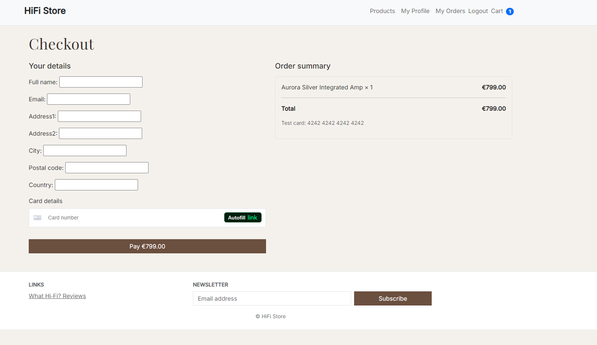 |
| Order Confirmation | Users receive an on-screen confirmation with details of their purchase. | 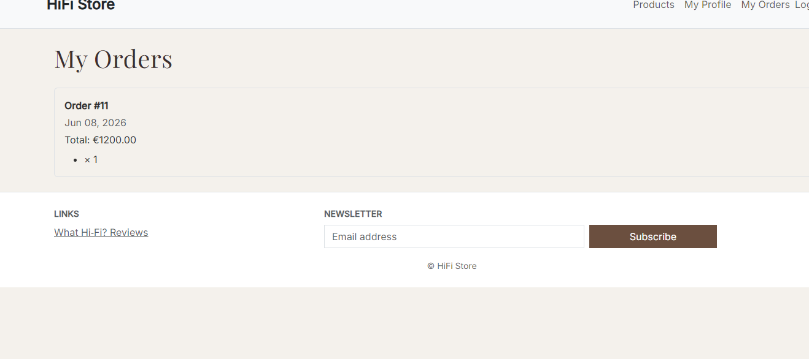 |
| Profile Management | Users can manage their profile information, including their default delivery address and order history. | 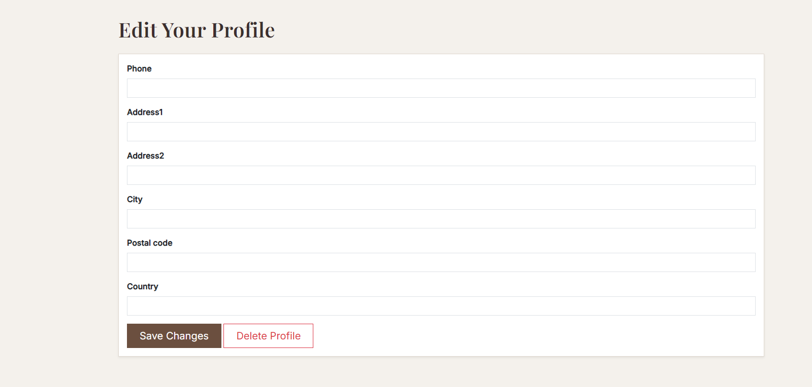 |
| Order History | Users can view their past orders and access details of each order, including products purchased and the delivery status. |  |
| Product Management | Superusers can add, edit, and delete products from the admin panel via a CRUD interface. | 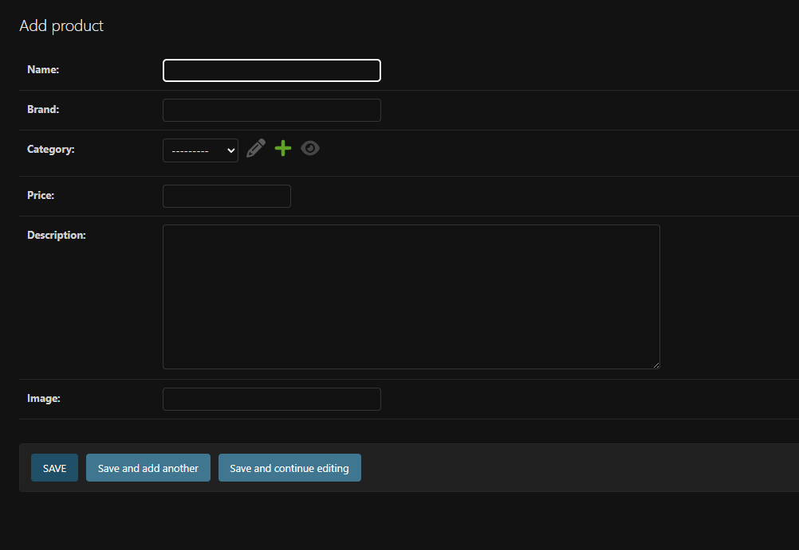 |
| Newsletter | Users can register their email address to receive newsletters from the site. Currently, this only stores the email in the database. |  |
| SEO | SEO optimization with a sitemap.xml, robots.txt, and appropriate meta tags to improve search engine visibility. | 
| 404 | The 404 error page will indicate when a user has navigated to a page that doesn't exist, replacing the default Heroku 404 page with one that ties into the site's look and feel. | 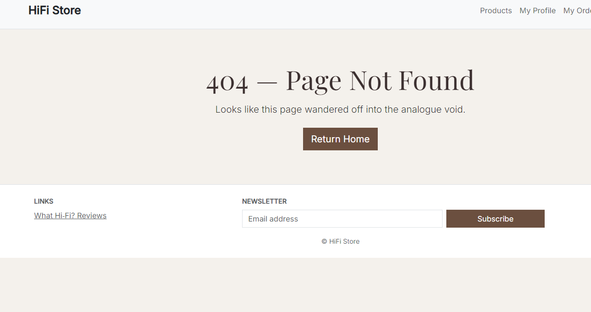 |

## Tools & Technologies

| Tool / Tech | Use |
| --- | --- |
| [](https://markdown.2bn.dev) | Generate README and TESTING templates. |
| [](https://git-scm.com) | Version control. (`git add`, `git commit`, `git push`) |
| [](https://github.com) | Secure online code storage. |
| [](https://code.visualstudio.com) | Local IDE for development. |
| [](https://en.wikipedia.org/wiki/HTML) | Main site content and layout. |
| [](https://en.wikipedia.org/wiki/CSS) | Design and layout. |
| [](https://www.javascript.com) | User interaction on the site. |
| [](https://www.python.org) | Back-end programming language. |
| [](https://www.heroku.com) | Hosting the deployed back-end site. |
| [](https://getbootstrap.com) | Front-end CSS framework for modern responsiveness and pre-built components. |
| [](https://www.djangoproject.com) | Python framework for the site. |
| [](https://www.postgresql.org) | Relational database management. |
| [](https://whitenoise.readthedocs.io) | Serving static files with Heroku. |
| [](https://stripe.com) | Online secure payments of e-commerce products/services. |
| [](https://github.com/copilot) | Help debug, troubleshoot, and explain things. |


## Marketing Strategy

### Target Audience
HiFi Store targets audio enthusiasts, who value high‑quality sound equipment — from headphones and speakers to amplifiers and accessories. The audience includes both casual listeners and semi‑professional users who appreciate premium audio products and a reliable online shopping experience. Secondary audiences include gift buyers and small studio owners seeking affordable, high‑fidelity gear.

### Brand Identity and Messaging
The brand identity emphasizes premium sound, modern design, and trust. Messaging focuses on clarity, performance, and value — appealing to users who want reliable, high‑fidelity audio equipment without unnecessary complexity. Visual branding uses dark tones, clean typography, and product‑forward imagery to evoke professionalism and quality.

### Marketing Channels
HiFi Store’s marketing approach combines organic SEO and social media engagement:

- **Facebook:** Primary channel for product promotion and community engagement. Posts highlight new arrivals, seasonal sales, and featured products.
- **Search Engine Optimization (SEO):** Implemented via canonical `sitemap.xml`, `robots.txt`, descriptive meta tags, and Open Graph data to improve discoverability.
- **Email Marketing (future scope):** Planned for personalized offers and post‑purchase follow‑ups.
- **Word‑of‑Mouth and Reviews:** Encouraged through user testimonials and product ratings.

### Facebook Integration
The site integrates Facebook Pixel to track user interactions and support remarketing campaigns. This enables targeted advertising and audience insights, helping the brand reach users who previously visited the site or interacted with posts.


### Content Strategy
HiFi Store’s content focuses on educating and inspiring users:

- Product spotlights and comparisons
- Audio setup tips and guides
- Seasonal promotions and limited‑time offers
- Brand and design philosophy highlights

This mix of informative and promotional content builds trust and maintains engagement.

### Marketing Goals
1. Increase brand visibility through consistent Facebook posting and SEO optimization.
2. Drive traffic from social media to the e‑commerce site.
3. Convert visitors into customers through clear product presentation and a streamlined checkout flow.
4. Build long‑term loyalty through quality content and responsive support.

### Example Campaigns
- **Spring Sale Campaign:** “Up to 20% off selected audio gear — limited time only.”
- **Product Spotlight:** “Discover the X200 Studio Headphones — engineered for pure, immersive sound.”
- **Community Engagement:** “Share your setup — tag @HiFiStore for a chance to be featured!”

### Performance Tracking
Key success metrics include:

- Facebook engagement (likes, shares, comments)
- Website traffic from social media referrals
- Conversion rate from Facebook Pixel analytics
- SEO ranking improvements for relevant product keywords

## Testing

> [!NOTE]  
> For all testing, please refer to the [TESTING.md](TESTING.md) file.

## Deployment

The live deployed application can be found deployed on [Heroku](https://hifi-store-project-5-61926ce0a9e2.herokuapp.com).

### Heroku Deployment

This project uses [Heroku](https://www.heroku.com), a platform as a service (PaaS) that enables developers to build, run, and operate applications entirely in the cloud.

Deployment steps are as follows, after account setup:

- Select **New** in the top-right corner of your Heroku Dashboard, and select **Create new app** from the dropdown menu.
- Your app name must be unique, and then choose a region closest to you (EU or USA), then finally, click **Create App**.
- From the new app **Settings**, click **Reveal Config Vars**, and set your environment variables to match your private `env.py` file.

> [!IMPORTANT]  
> This is a sample only; you would replace the values with your own if cloning/forking my repository.


| Key | Value |
| --- | --- |
| `ALLOWED_HOSTS` | your-heroku-app-domain.herokuapp.com |
| `CSRF_TRUSTED_ORIGINS` | your-heroku-app-domain.herokuapp.com |
| `DATABASE_URL` | user-inserts-own-postgres-database-url |
| `SECRET_KEY` | any-random-secret-key |
| `STRIPE_PUBLIC_KEY` | user-inserts-own-stripe-public-key |
| `STRIPE_SECRET_KEY` | user-inserts-own-stripe-secret-key |

Heroku needs some additional files in order to deploy properly.

- [requirements.txt](requirements.txt)
- [Procfile](Procfile)
- [.python-version](.python-version)

### PostgreSQL

This project uses a [Code Institute PostgreSQL Database](https://dbs.ci-dbs.net) for the Relational Database with Django.

> [!CAUTION]
> - PostgreSQL databases by Code Institute are only available to CI Students.
> - You must acquire your own PostgreSQL database through some other method if you plan to clone/fork this repository.
> - Code Institute students are allowed a maximum of 8 databases.
> - Databases are subject to deletion after 18 months.

To obtain my own Postgres Database from Code Institute, I followed these steps:

- Submitted my email address to the CI PostgreSQL Database link above.
- An email was sent to me with my new Postgres Database.
- The Database connection string will resemble something like this:
    - `postgres://<db_username>:<db_password>@<db_host_url>/<db_name>`
- You can use the above URL with Django; simply paste it into your `env.py` file and Heroku Config Vars as `DATABASE_URL`.

### Stripe API

This project uses [Stripe](https://stripe.com) to handle the ecommerce payments.

Once you've created a Stripe account and logged-in, follow these series of steps to get your project connected.

- From your Stripe dashboard, click to expand the "Get your test API keys".
- You'll have two keys here:
	- `STRIPE_PUBLIC_KEY` = Publishable Key (starts with **pk**)
	- `STRIPE_SECRET_KEY` = Secret Key (starts with **sk**)

### WhiteNoise

This project uses the [WhiteNoise](https://whitenoise.readthedocs.io/en/latest/) to aid with static files temporarily hosted on the live Heroku site.

To include WhiteNoise in your own projects:

- Install the latest WhiteNoise package:
    - `pip install whitenoise`
- Update the `requirements.txt` file with the newly installed package:
    - `pip freeze --local > requirements.txt`
- Edit your `settings.py` file and add WhiteNoise to the `MIDDLEWARE` list, above all other middleware (apart from Django’s "SecurityMiddleware"):

```python
# settings.py

MIDDLEWARE = [
    'django.middleware.security.SecurityMiddleware',
    'whitenoise.middleware.WhiteNoiseMiddleware',
    # any additional middleware
]
```

### Cloning

You can clone the repository by following these steps:

1. Go to the [GitHub repository](https://www.github.com/andreaspe76/Portfolio_Project_5).
2. Locate and click on the green "Code" button at the very top, above the commits and files.
3. Select whether you prefer to clone using "HTTPS", "SSH", or "GitHub CLI", and click the "copy" button to copy the URL to your clipboard.
4. Open "Git Bash" or "Terminal".
5. Change the current working directory to the location where you want the cloned directory.
6. In your IDE Terminal, type the following command to clone the repository:
	- `git clone https://www.github.com/andreaspe76/Portfolio_Project_5.git`
7. Press "Enter" to create your local clone.

Alternatively, if using Ona (formerly Gitpod), you can click below to create your own workspace using this repository.

[](https://gitpod.io/#https://www.github.com/andreaspe76/Portfolio_Project_5)

**Please Note**: in order to directly open the project in Ona (Gitpod), you should have the browser extension installed. A tutorial on how to do that can be found [here](https://www.gitpod.io/docs/configure/user-settings/browser-extension).

#### Forking

By forking the GitHub Repository, you make a copy of the original repository on our GitHub account to view and/or make changes without affecting the original owner's repository. You can fork this repository by using the following steps:

1. Log in to GitHub and locate the [GitHub Repository](https://www.github.com/andreaspe76/Portfolio_Project_5).
2. At the top of the Repository, just below the "Settings" button on the menu, locate and click the "Fork" Button.
3. Once clicked, you should now have a copy of the original repository in your own GitHub account!

## Credits

| Source | Notes |
| --- | --- |
| [Markdown Builder](https://markdown.2bn.dev) | Help generating Markdown files |
| [Chris Beams](https://chris.beams.io/posts/git-commit) | "How to Write a Git Commit Message" |
| [Boutique Ado](https://codeinstitute.net) | Code Institute walkthrough project inspiration |
| [Bootstrap](https://getbootstrap.com) | Various components / responsive front-end framework |
| [Whitenoise](https://whitenoise.readthedocs.io) | Static file service |
| [Stripe](https://docs.stripe.com/payments/elements) | Online payment services |
| [Python Tutor](https://pythontutor.com) | Additional Python help |
| [VS Code Copilot](https://code.visualstudio.com) | Help with code logic, explanations and code completion |
| [Django Oscar](https://django-oscar.readthedocs.io) | E-commerce framework for Django |
| [Django Allauth](https://django-allauth.readthedocs.io) | User authentication for Django |
| [RealPython Django Tutorials](https://realpython.com/tutorials/django/) | High level Python web framework focused on rapid development and clean design |

### Media

All images used in this project was either created by myself, or by MS Copilot.

| Source | Notes |
| --- | --- |
| [favicon.io](https://favicon.io) | Generating the favicon |
| [Boutique Ado](https://codeinstitute.net) | Sample images provided from the walkthrough projects |

### Acknowledgements

- I would like to thank my Code Institute mentor, [Tim Nelson](https://www.github.com/TravelTimN) for the support at the final resubmission of this project and for letting me use his automated README & TESTING.md templates.
- I would like to thank the [Code Institute](https://codeinstitute.net) Tutor Team for their assistance with troubleshooting and debugging some project issues.
- I would like to thank my partner, for believing in me, and allowing me to make this transition into software development.
- I would like to thank my employer, for supporting me in my career development change towards becoming a software developer.