# Testing

> [!NOTE]  
> Return back to the [README.md](README.md) file.

## Code Validation

### HTML

I have used [Nu Html Checker](https://validator.nu/) to validate all of my HTML files.

| Directory | File | URL | Screenshot | Notes |
| --- | --- | --- | --- | --- |
| accounts | [delete_profile.html](https://github.com/andreaspe76/Portfolio_Project_5/blob/main/accounts/templates/accounts/delete_profile.html) | 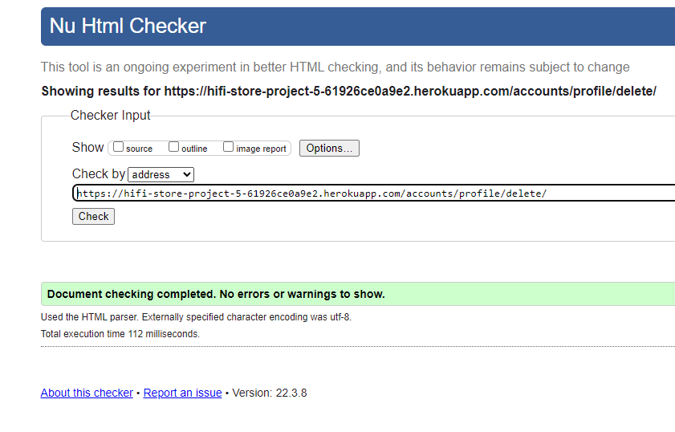 |
| accounts | [edit_profile.html](https://github.com/andreaspe76/Portfolio_Project_5/blob/main/accounts/templates/accounts/edit_profile.html) | 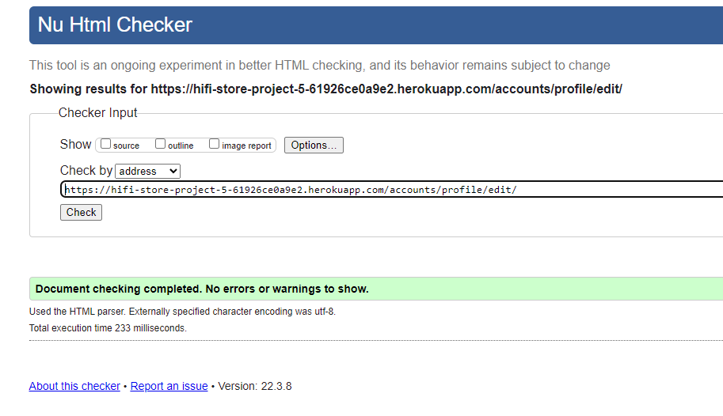 |
| checkout | [checkout.html](https://github.com/andreaspe76/Portfolio_Project_5/blob/main/checkout/templates/checkout/checkout.html) | 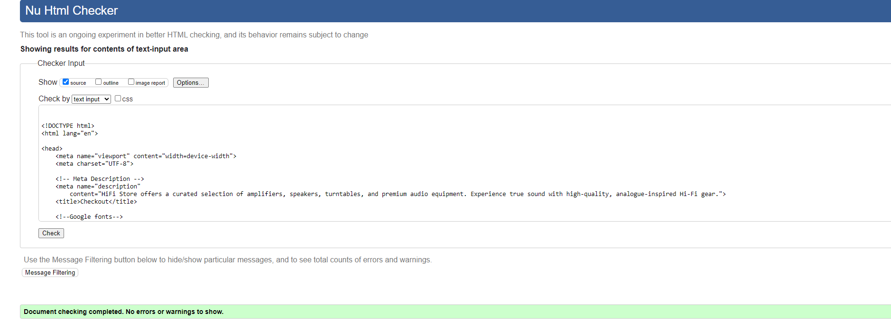 |
| checkout | [checkout_success.html](https://github.com/andreaspe76/Portfolio_Project_5/blob/main/checkout/templates/checkout/checkout_success.html) | 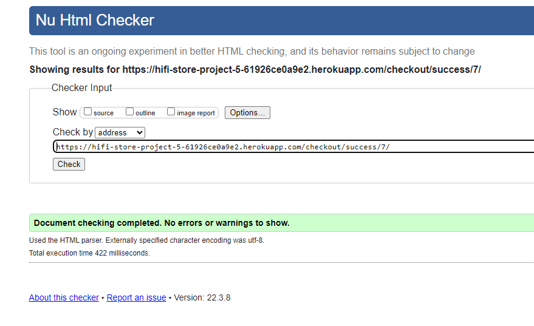 |
| checkout | [my_orders.html](https://github.com/andreaspe76/Portfolio_Project_5/blob/main/checkout/templates/checkout/my_orders.html) | 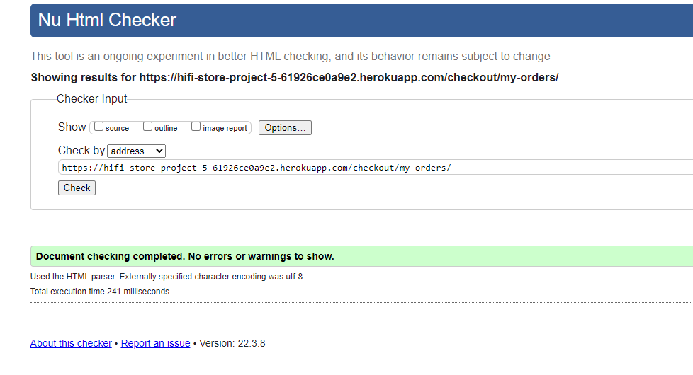 |
| products | [cart_detail.html](https://github.com/andreaspe76/Portfolio_Project_5/blob/main/products/templates/products/cart_detail.html) | 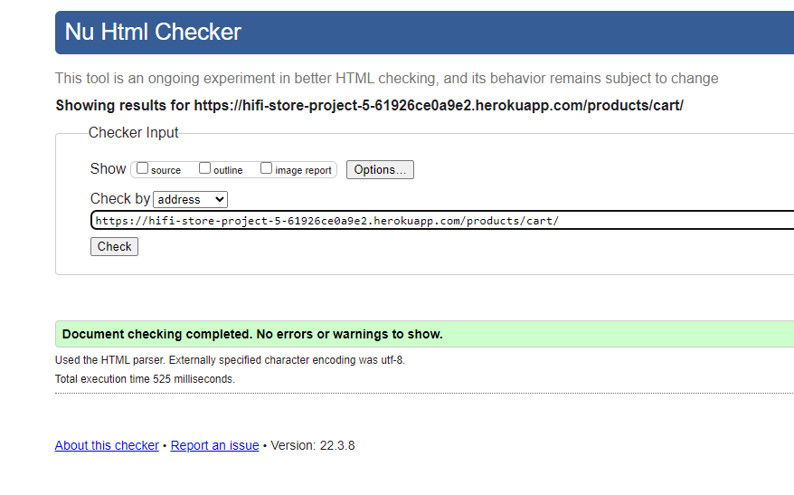 |
| products | [product_detail.html](https://github.com/andreaspe76/Portfolio_Project_5/blob/main/products/templates/products/product_detail.html) | 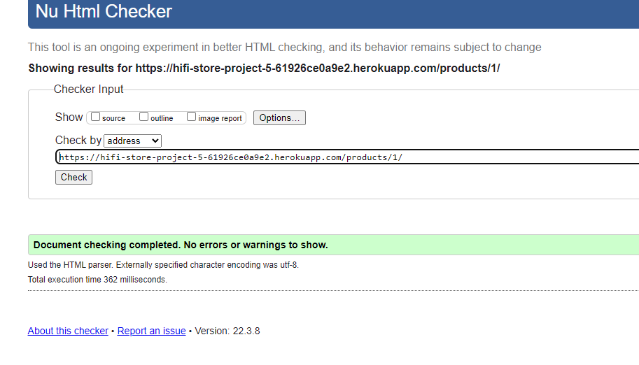 |
| products | [product_detail_mobile.html](https://github.com/andreaspe76/Portfolio_Project_5/blob/main/products/templates/products/product_detail_mobile.html) | 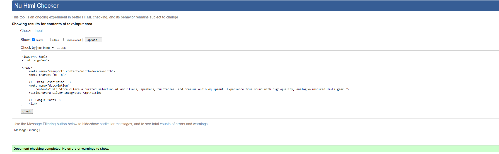 |
| products | [product_list.html](https://github.com/andreaspe76/Portfolio_Project_5/blob/main/products/templates/products/product_list.html) | 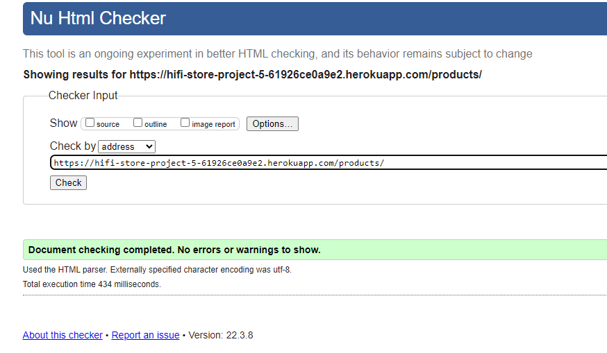 |
| products | [product_list_mobile.html](https://github.com/andreaspe76/Portfolio_Project_5/blob/main/products/templates/products/product_list_mobile.html) |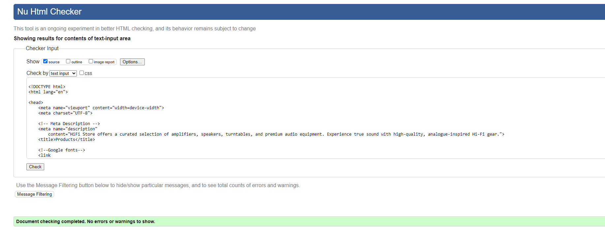 |
| templates | [404.html](https://github.com/andreaspe76/Portfolio_Project_5/blob/main/templates/404.html) | 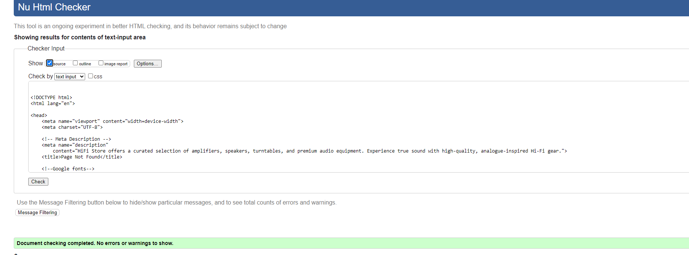 |
| templates | [home.html](https://github.com/andreaspe76/Portfolio_Project_5/blob/main/templates/home.html) | 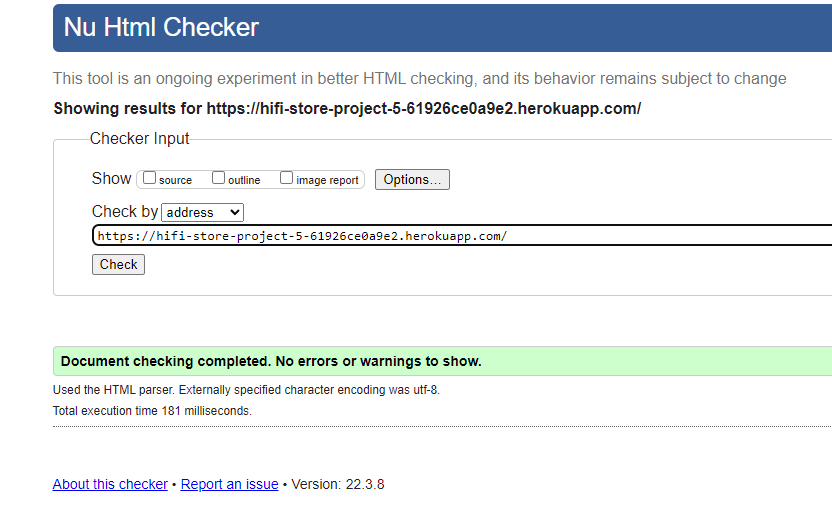 |
| templates | [login.html](https://github.com/andreaspe76/Portfolio_Project_5/blob/main/templates/registration/login.html) | 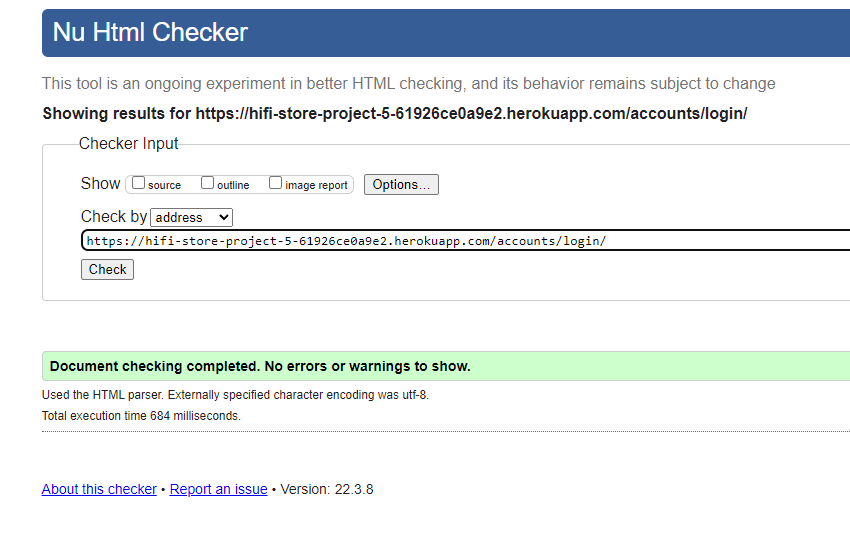 |
| templates | [register.html](https://github.com/andreaspe76/Portfolio_Project_5/blob/main/templates/registration/register.html) | 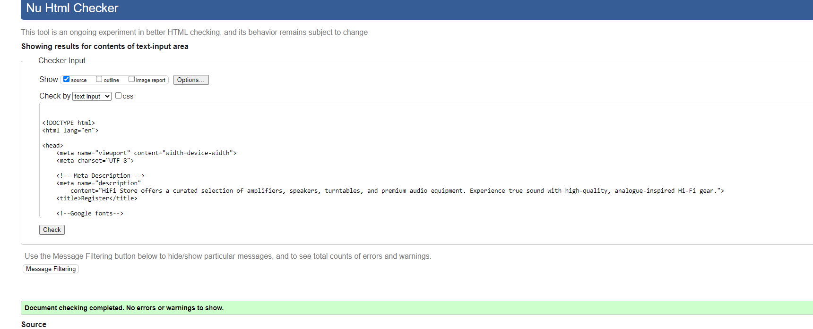 |

### CSS

I have used the recommended [CSS Jigsaw Validator](https://jigsaw.w3.org/css-validator) to validate all of my CSS files.

| Directory | File | URL | Screenshot | Notes |
| --- | --- | --- | --- | --- |
| products | [style.css](https://github.com/andreaspe76/Portfolio_Project_5/blob/main/products/static/products/css/style.css) | 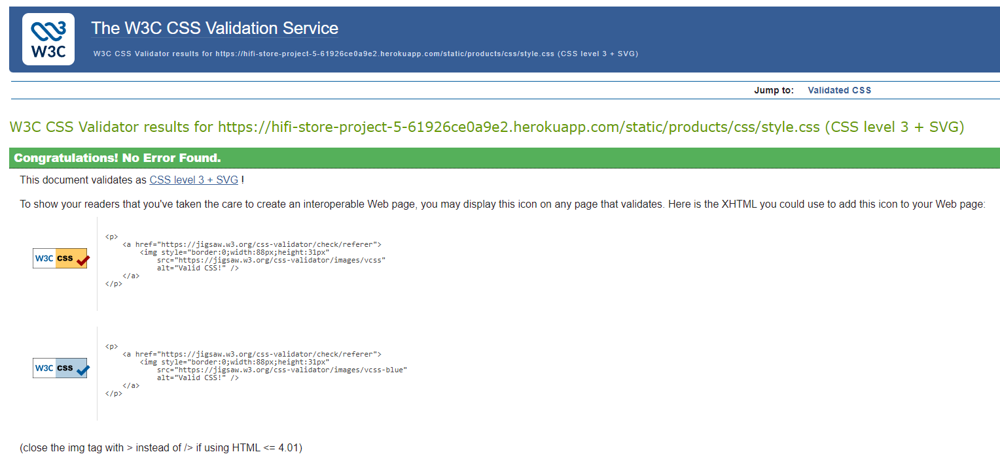 |