# Testing

> [!NOTE]  
> Return back to the [README.md](README.md) file.

## Code python

### HTML

I have used [Nu Html Checker](https://validator.nu/) to validate all of my HTML files.

| Directory | File | URL | Screenshot | Notes |
| --- | --- | --- | --- | --- |
| accounts | [delete_profile.html](https://github.com/andreaspe76/Portfolio_Project_5/blob/main/accounts/templates/accounts/delete_profile.html) |  |
| accounts | [edit_profile.html](https://github.com/andreaspe76/Portfolio_Project_5/blob/main/accounts/templates/accounts/edit_profile.html) |  |
| checkout | [checkout.html](https://github.com/andreaspe76/Portfolio_Project_5/blob/main/checkout/templates/checkout/checkout.html) |  |
| checkout | [checkout_success.html](https://github.com/andreaspe76/Portfolio_Project_5/blob/main/checkout/templates/checkout/checkout_success.html) |  |
| checkout | [my_orders.html](https://github.com/andreaspe76/Portfolio_Project_5/blob/main/checkout/templates/checkout/my_orders.html) |  |
| products | [cart_detail.html](https://github.com/andreaspe76/Portfolio_Project_5/blob/main/products/templates/products/cart_detail.html) |  |
| products | [product_detail.html](https://github.com/andreaspe76/Portfolio_Project_5/blob/main/products/templates/products/product_detail.html) |  |
| products | [product_detail_mobile.html](https://github.com/andreaspe76/Portfolio_Project_5/blob/main/products/templates/products/product_detail_mobile.html) |  |
| products | [product_list.html](https://github.com/andreaspe76/Portfolio_Project_5/blob/main/products/templates/products/product_list.html) |  |
| products | [product_list_mobile.html](https://github.com/andreaspe76/Portfolio_Project_5/blob/main/products/templates/products/product_list_mobile.html) | |
| templates | [404.html](https://github.com/andreaspe76/Portfolio_Project_5/blob/main/templates/404.html) |  |
| templates | [home.html](https://github.com/andreaspe76/Portfolio_Project_5/blob/main/templates/home.html) |  |
| templates | [login.html](https://github.com/andreaspe76/Portfolio_Project_5/blob/main/templates/registration/login.html) |  |
| templates | [register.html](https://github.com/andreaspe76/Portfolio_Project_5/blob/main/templates/registration/register.html) |  |

### CSS

I have used the recommended [CSS Jigsaw Validator](https://jigsaw.w3.org/css-validator) to validate all of my CSS files.

| Directory | File | URL | Screenshot | Notes |
| --- | --- | --- | --- | --- |
| products | [style.css](https://github.com/andreaspe76/Portfolio_Project_5/blob/main/products/static/products/css/style.css) |  |

### Python

I have used the recommended [PEP8 CI Python Linter](https://pep8ci.herokuapp.com) to validate all of my Python files.

| Directory | File | URL | Screenshot | Notes |
| --- | --- | --- | --- | --- |
| accounts | [admin.py](https://github.com/andreaspe76/Portfolio_Project_5/blob/main/accounts/admin.py) | [PEP8 CI Link](https://pep8ci.herokuapp.com/https://raw.githubusercontent.com/andreaspe76/Portfolio_Project_5/main/accounts/admin.py) | 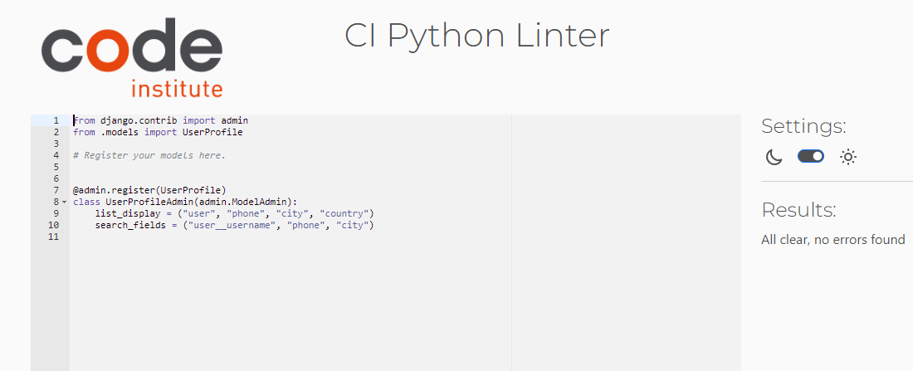 |
| accounts | [forms.py](https://github.com/andreaspe76/Portfolio_Project_5/blob/main/accounts/forms.py) | [PEP8 CI Link](https://pep8ci.herokuapp.com/https://raw.githubusercontent.com/andreaspe76/Portfolio_Project_5/main/accounts/forms.py) | 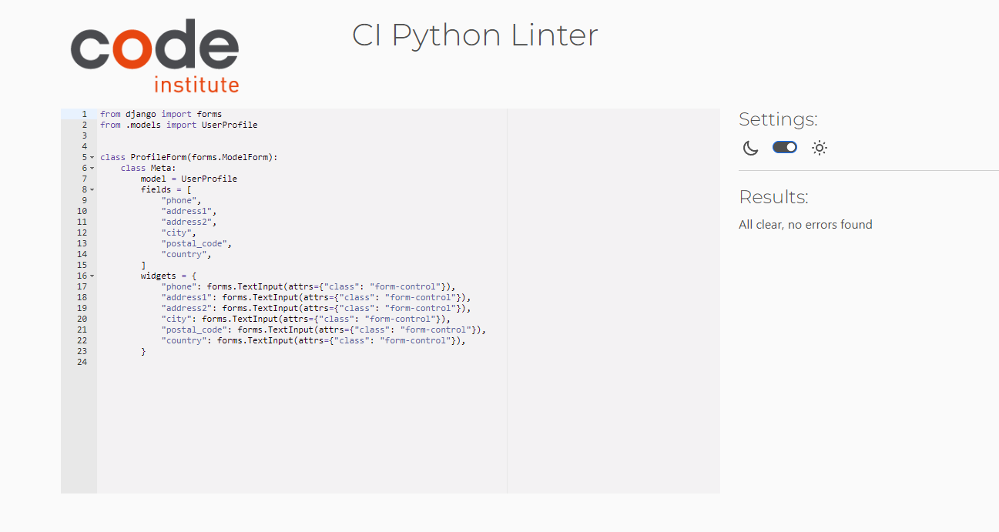 |
| accounts | [models.py](https://github.com/andreaspe76/Portfolio_Project_5/blob/main/accounts/models.py) | [PEP8 CI Link](https://pep8ci.herokuapp.com/https://raw.githubusercontent.com/andreaspe76/Portfolio_Project_5/main/accounts/models.py) | 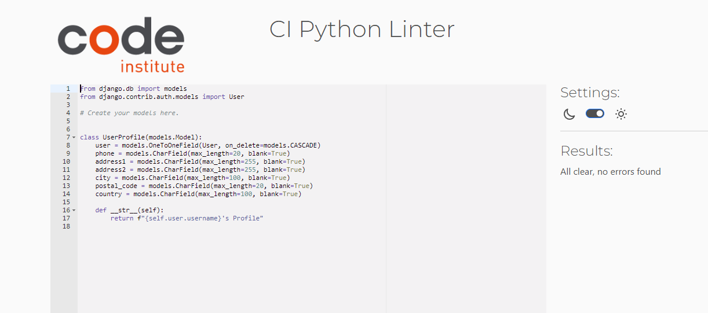 |
| accounts | [signals.py](https://github.com/andreaspe76/Portfolio_Project_5/blob/main/accounts/signals.py) | [PEP8 CI Link](https://pep8ci.herokuapp.com/https://raw.githubusercontent.com/andreaspe76/Portfolio_Project_5/main/accounts/signals.py) | 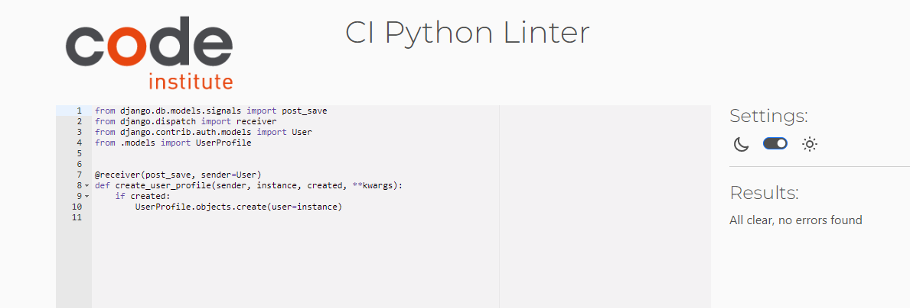 |
| accounts | [urls.py](https://github.com/andreaspe76/Portfolio_Project_5/blob/main/accounts/urls.py) | [PEP8 CI Link](https://pep8ci.herokuapp.com/https://raw.githubusercontent.com/andreaspe76/Portfolio_Project_5/main/accounts/urls.py) | 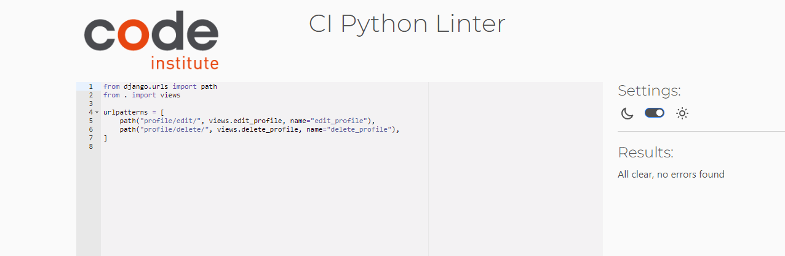 |
| accounts | [views.py](https://github.com/andreaspe76/Portfolio_Project_5/blob/main/accounts/views.py) | [PEP8 CI Link](https://pep8ci.herokuapp.com/https://raw.githubusercontent.com/andreaspe76/Portfolio_Project_5/main/accounts/views.py) | 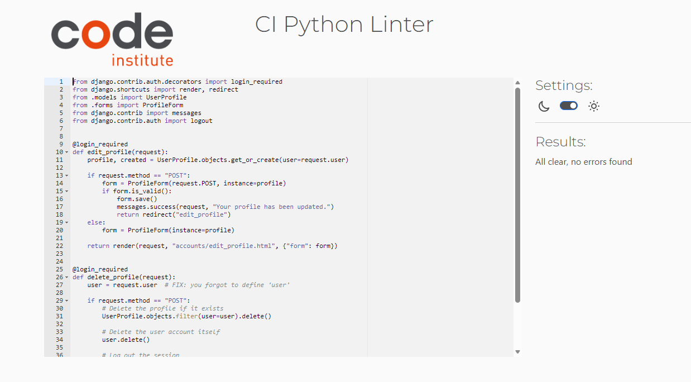 |
| checkout | [admin.py](https://github.com/andreaspe76/Portfolio_Project_5/blob/main/checkout/admin.py) | [PEP8 CI Link](https://pep8ci.herokuapp.com/https://raw.githubusercontent.com/andreaspe76/Portfolio_Project_5/main/checkout/admin.py) | 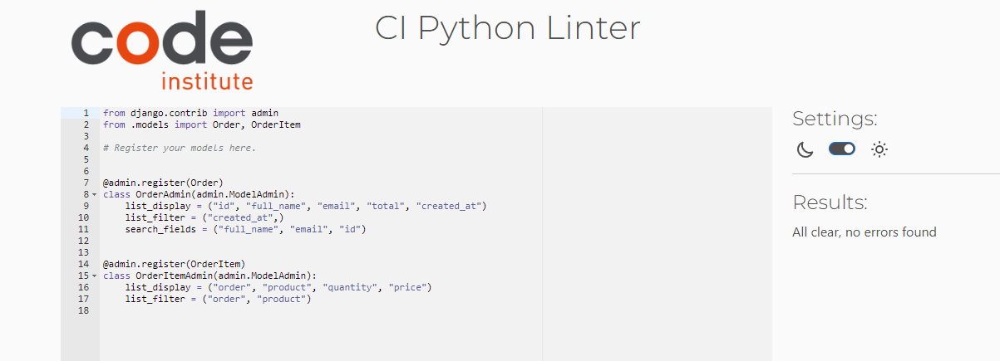 |
| checkout | [forms.py](https://github.com/andreaspe76/Portfolio_Project_5/blob/main/checkout/forms.py) | [PEP8 CI Link](https://pep8ci.herokuapp.com/https://raw.githubusercontent.com/andreaspe76/Portfolio_Project_5/main/checkout/forms.py) | 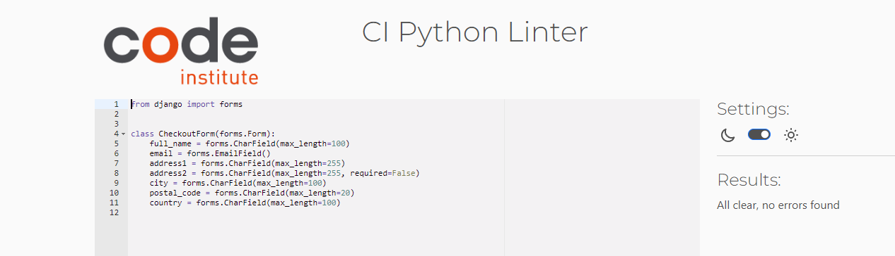 |
| checkout | [models.py](https://github.com/andreaspe76/Portfolio_Project_5/blob/main/checkout/models.py) | [PEP8 CI Link](https://pep8ci.herokuapp.com/https://raw.githubusercontent.com/andreaspe76/Portfolio_Project_5/main/checkout/models.py) | 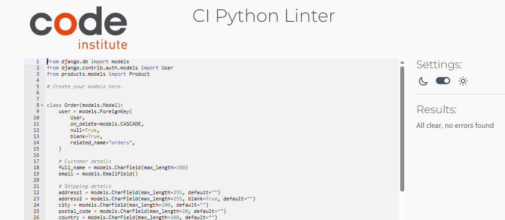 |
| checkout | [urls.py](https://github.com/andreaspe76/Portfolio_Project_5/blob/main/checkout/urls.py) | [PEP8 CI Link](https://pep8ci.herokuapp.com/https://raw.githubusercontent.com/andreaspe76/Portfolio_Project_5/main/checkout/urls.py) | 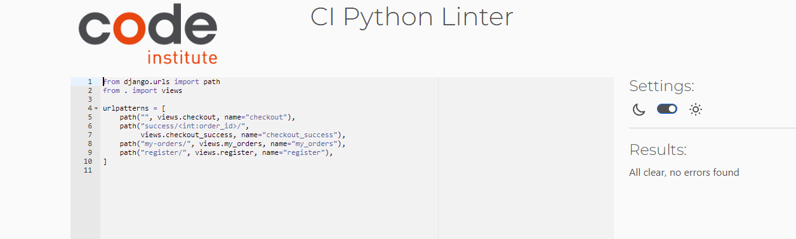 |
| checkout | [views.py](https://github.com/andreaspe76/Portfolio_Project_5/blob/main/checkout/views.py) | [PEP8 CI Link](https://pep8ci.herokuapp.com/https://raw.githubusercontent.com/andreaspe76/Portfolio_Project_5/main/checkout/views.py) | 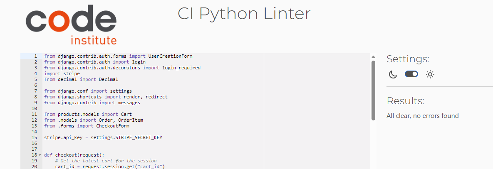 |
| hifi_store | [admin.py](https://github.com/andreaspe76/Portfolio_Project_5/blob/main/hifi_store/admin.py) | [PEP8 CI Link](https://pep8ci.herokuapp.com/https://raw.githubusercontent.com/andreaspe76/Portfolio_Project_5/main/hifi_store/admin.py) | 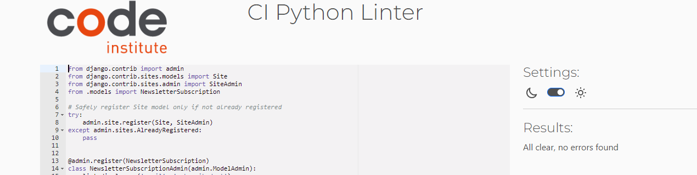 |
| hifi_store | [models.py](https://github.com/andreaspe76/Portfolio_Project_5/blob/main/hifi_store/models.py) | [PEP8 CI Link](https://pep8ci.herokuapp.com/https://raw.githubusercontent.com/andreaspe76/Portfolio_Project_5/main/hifi_store/models.py) | 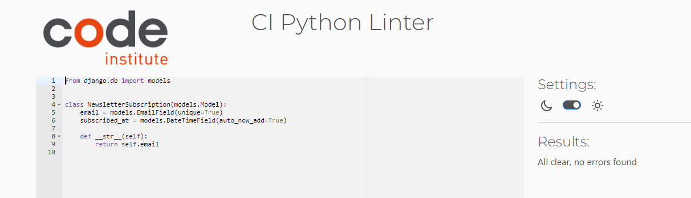 |
| hifi_store | [settings.py](https://github.com/andreaspe76/Portfolio_Project_5/blob/main/hifi_store/settings.py) | [PEP8 CI Link](https://pep8ci.herokuapp.com/https://raw.githubusercontent.com/andreaspe76/Portfolio_Project_5/main/hifi_store/settings.py) | 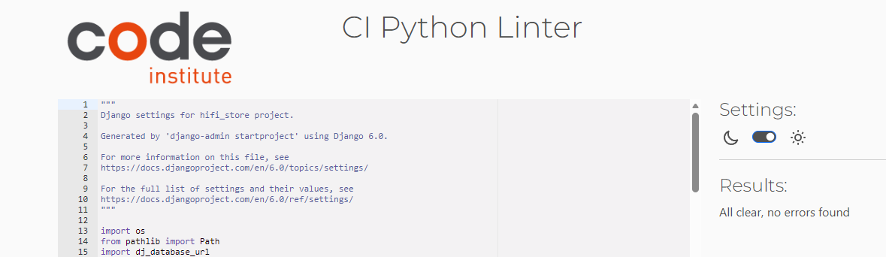 |
| hifi_store | [urls.py](https://github.com/andreaspe76/Portfolio_Project_5/blob/main/hifi_store/urls.py) | [PEP8 CI Link](https://pep8ci.herokuapp.com/https://raw.githubusercontent.com/andreaspe76/Portfolio_Project_5/main/hifi_store/urls.py) | 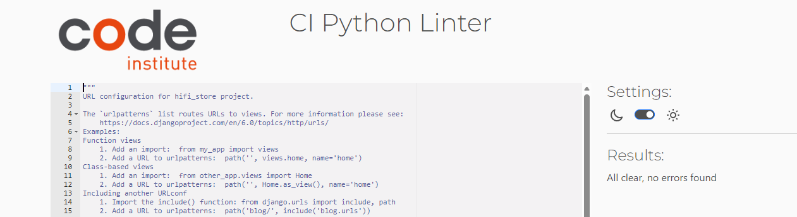 |
| hifi_store | [views.py](https://github.com/andreaspe76/Portfolio_Project_5/blob/main/hifi_store/views.py) | [PEP8 CI Link](https://pep8ci.herokuapp.com/https://raw.githubusercontent.com/andreaspe76/Portfolio_Project_5/main/hifi_store/views.py) | 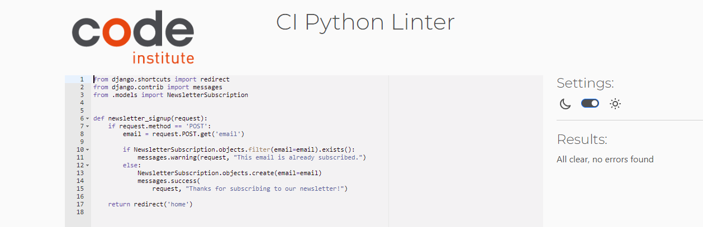 |
|  | [manage.py](https://github.com/andreaspe76/Portfolio_Project_5/blob/main/manage.py) | [PEP8 CI Link](https://pep8ci.herokuapp.com/https://raw.githubusercontent.com/andreaspe76/Portfolio_Project_5/main/manage.py) | 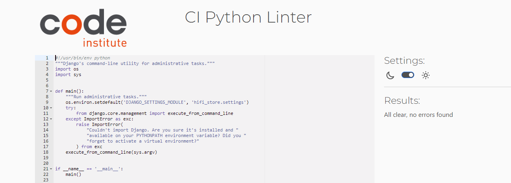 |
| products | [admin.py](https://github.com/andreaspe76/Portfolio_Project_5/blob/main/products/admin.py) | [PEP8 CI Link](https://pep8ci.herokuapp.com/https://raw.githubusercontent.com/andreaspe76/Portfolio_Project_5/main/products/admin.py) | 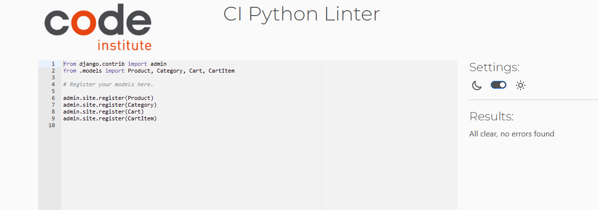 |
| products | [context_processors.py](https://github.com/andreaspe76/Portfolio_Project_5/blob/main/products/context_processors.py) | [PEP8 CI Link](https://pep8ci.herokuapp.com/https://raw.githubusercontent.com/andreaspe76/Portfolio_Project_5/main/products/context_processors.py) | 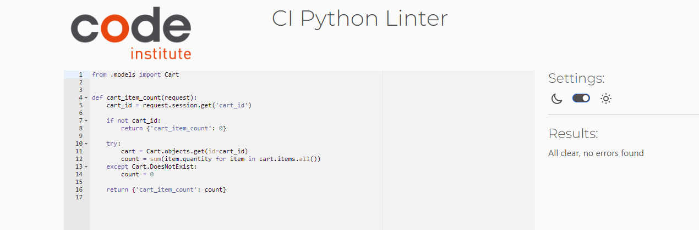 |
| products | [models.py](https://github.com/andreaspe76/Portfolio_Project_5/blob/main/products/models.py) | [PEP8 CI Link](https://pep8ci.herokuapp.com/https://raw.githubusercontent.com/andreaspe76/Portfolio_Project_5/main/products/models.py) | 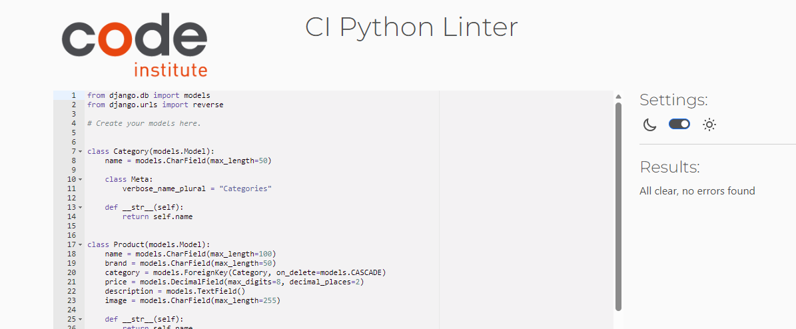 |
| products | [sitemaps.py](https://github.com/andreaspe76/Portfolio_Project_5/blob/main/products/sitemaps.py) | [PEP8 CI Link](https://pep8ci.herokuapp.com/https://raw.githubusercontent.com/andreaspe76/Portfolio_Project_5/main/products/sitemaps.py) | 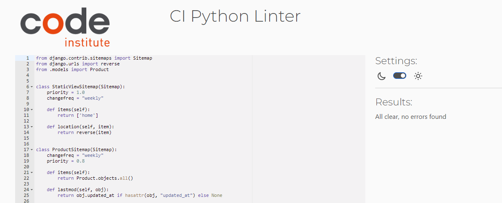 |
| products | [cart_extras.py](https://github.com/andreaspe76/Portfolio_Project_5/blob/main/products/templatetags/cart_extras.py) | [PEP8 CI Link](https://pep8ci.herokuapp.com/https://raw.githubusercontent.com/andreaspe76/Portfolio_Project_5/main/products/templatetags/cart_extras.py) | 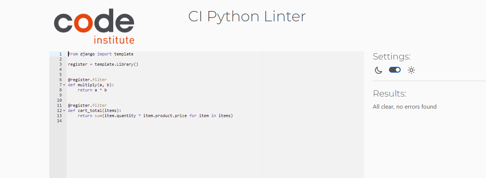 |
| products | [urls.py](https://github.com/andreaspe76/Portfolio_Project_5/blob/main/products/urls.py) | [PEP8 CI Link](https://pep8ci.herokuapp.com/https://raw.githubusercontent.com/andreaspe76/Portfolio_Project_5/main/products/urls.py) | 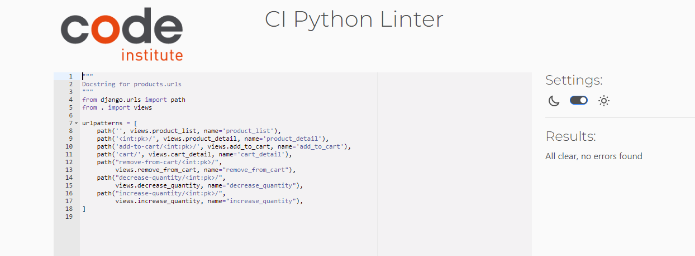 |
| products | [views.py](https://github.com/andreaspe76/Portfolio_Project_5/blob/main/products/views.py) | [PEP8 CI Link](https://pep8ci.herokuapp.com/https://raw.githubusercontent.com/andreaspe76/Portfolio_Project_5/main/products/views.py) | 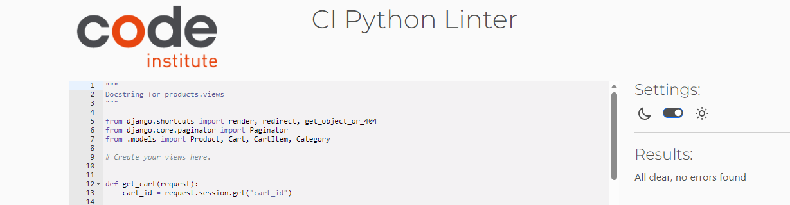 |

## Lighthouse Audit

I've tested my deployed project using the Lighthouse Audit tool to check for any major issues. Some warnings are outside of my control.

| Page | Mobile | Desktop |
| --- | --- | --- |
| Register | 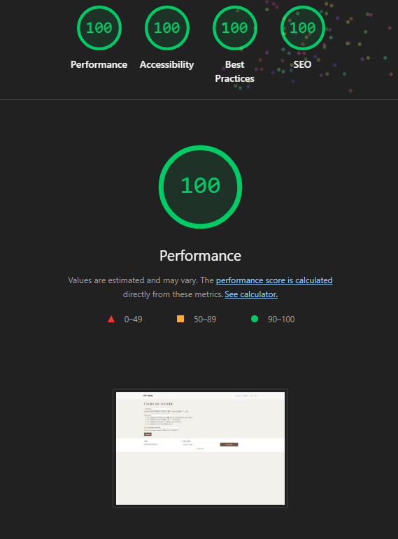 |
| Login |  |
| Profile |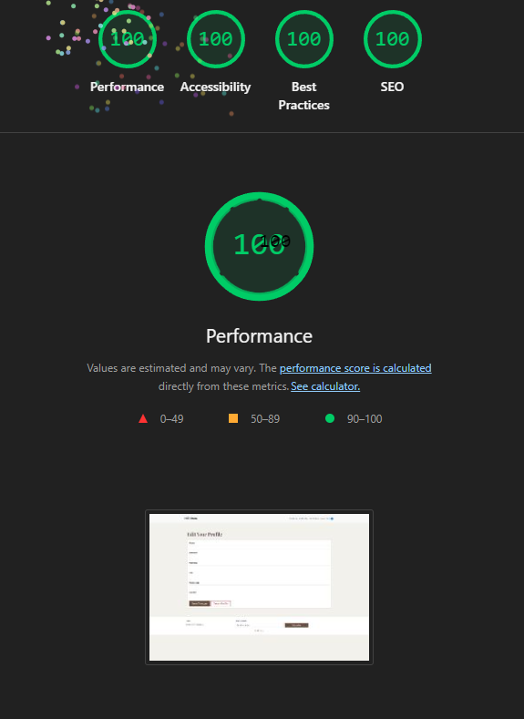 |
| Home | 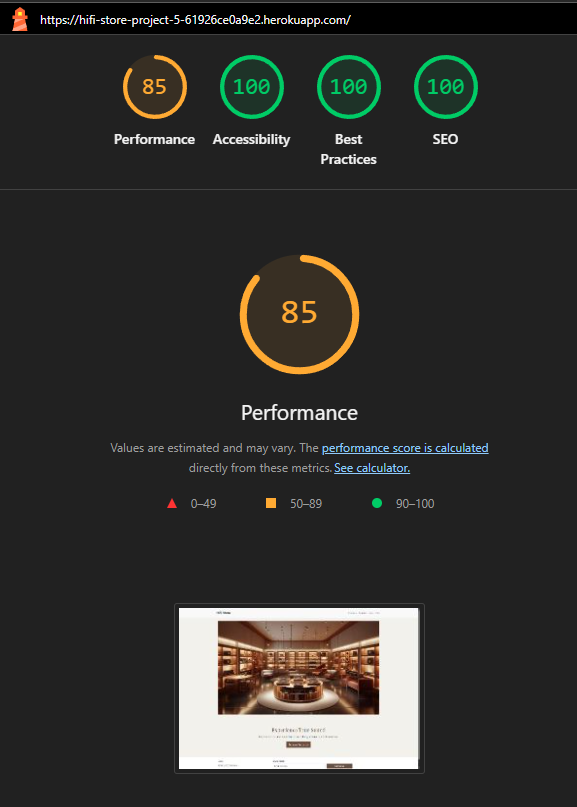 |
| Products | 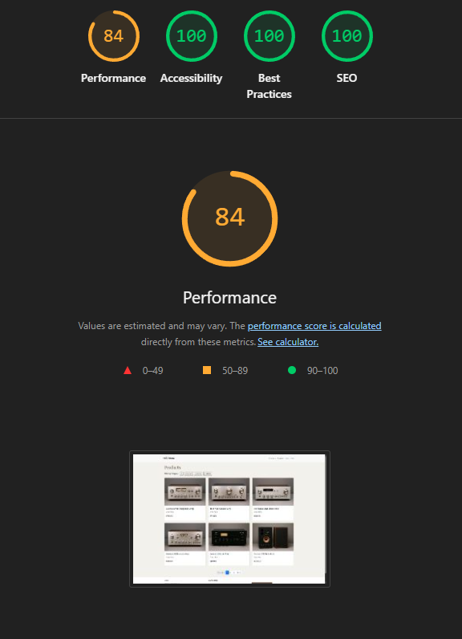 |
| Product Details | 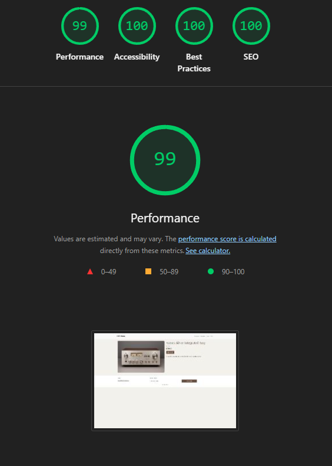 |
| Cart | 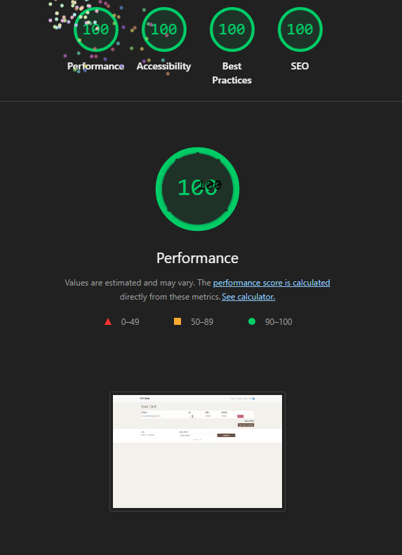 |
| Checkout | 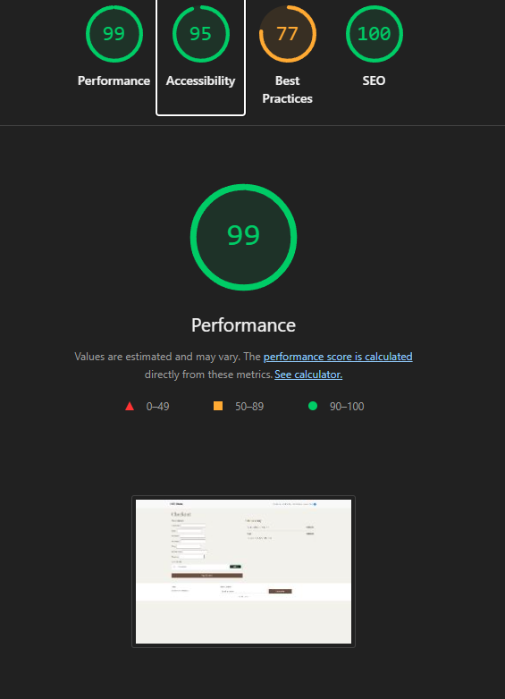 |
| Checkout Success | 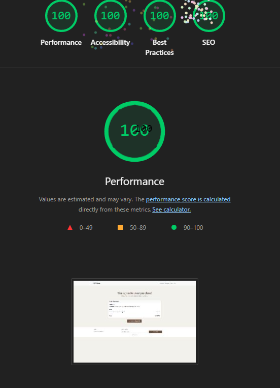 |
| 404 | 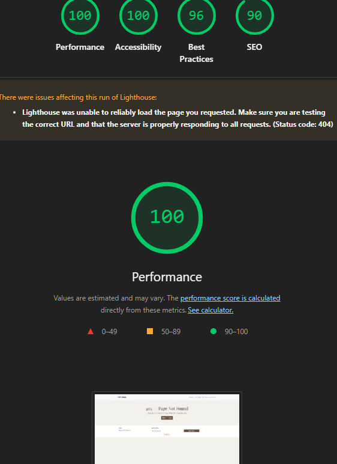 |

## Bugs

I have encountered several bugs during the development of this project, but I have been able to fix them all. Here are some of the bugs I encountered:

- Checkout total always showed €0 and Stripe rejected payment:
    - The checkout view attempted to read cart data from the session, however, the project uses a database‑backed cart (Cart and CartItem models), not a session cart.
    - I fixed this by updating the checkout view to read cart data from the database instead of the session.

- After completing a payment, the checkout success page loaded but immediately raised a NoReverseMatch error. The template attempted to generate a link back to the products page using , but Django could not find any URL pattern with that name.
    - The products app does not define a URL pattern named "products". Django’s  tag only works with the name assigned in urls.py, not the app name or folder name.
    - I updated the link in checkout_success.html to use the correct URL name defined in products/urls.py

- Error 500 when deleting a user profile due to protected Order relations
    - Attempting to delete a user profile caused a server error (HTTP 500). The deletion failed whenever the user had previously placed an order. Instead of removing the profile, Django raised an exception and the application crashed.
    -The Order model used on_delete=models.PROTECT on its foreign key to the user. This prevented the user from being deleted if any related orders existed. Since the project does not require historical order preservation for deleted users, the protective constraint caused unnecessary failures.
    - Updated the Order model to use: on_delete=models.CASCADE This allows Django to automatically delete all related orders when a user profile is removed. After updating the model, new migrations were created and applied.

### Known Issues

When a User deletes their profile, all of their orders are also deleted due to the on_delete=models.CASCADE setting on the Order model. This means that if a user deletes their profile, they will lose access to their order history. This is not ideal, but it is a trade‑off that I have made in order to allow users to delete their profiles without encountering errors and I plan to fix this in a future update by implementing a soft delete mechanism for user profiles, which would allow users to deactivate their accounts without permanently deleting their order history.

> There are no remaining bugs that I am aware of, though, even after thorough testing, I cannot rule out the possibility.